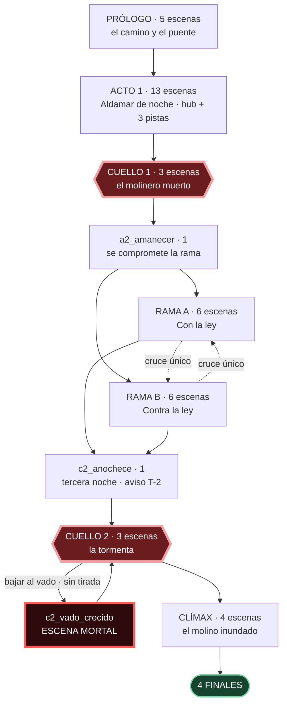
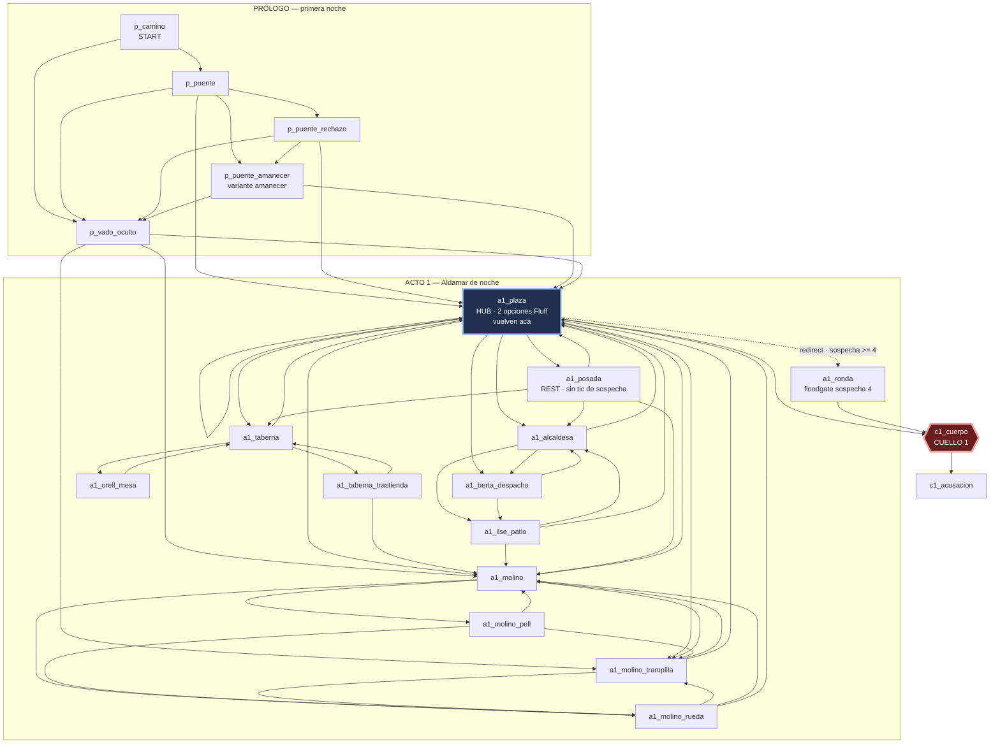
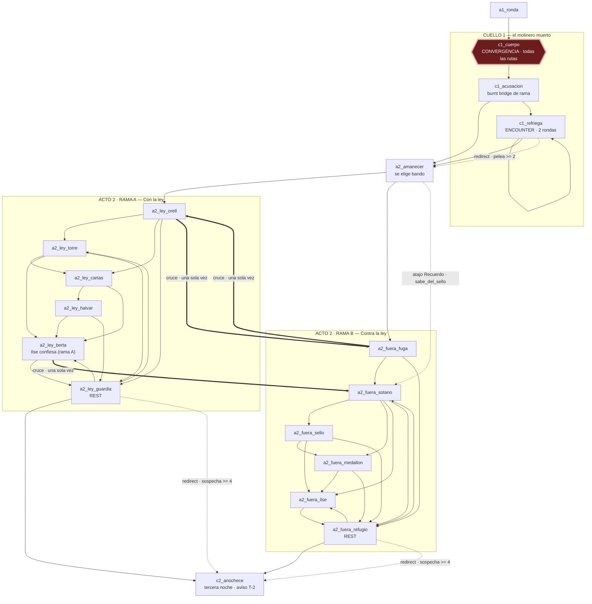
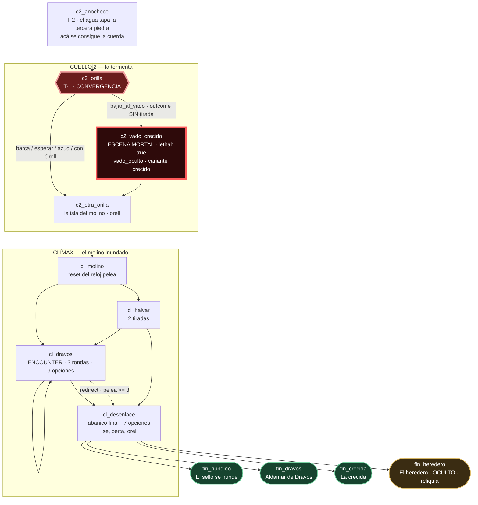

# Outline — "El vado de Aldamar"

> Mapa navegable de la campaña y **contrato** para quien construya el esqueleto en TypeScript (Fase C).
> Fuentes por encima de este documento: `docs/superpowers/specs/2026-09-10-juegorol-design.md` (§3, §4, §5, §11), `src/content/schema.ts`, `src/content/catalog.ts`, las 11 reglas de `tools/lib/validate/rules/` y `00-biblia.md`.
> **Si algo de acá choca con el validador, gana el validador.**
> **Todas las cuentas de la campaña viven en este documento.** La biblia manda en lo cualitativo (voces, tono, ficción, canon); acá manda la aritmética. Donde la biblia cite una cifra, está copiada de acá.

**Cifras cerradas de este outline:** 46 escenas · **253 opciones** (179 sin `requires`, 71 %) · **41 tiradas escritas** · 2 encuentros (5 rondas) · 1 escena mortal · 4 finales · **16 entradas de `redirect` en 16 escenas** · **15.900 palabras de prosa narrativa** · **17.850 palabras escritas en total** (subieron +256 en la Fase H · tarea 4 al corregir tres celdas imposibles; ver §2.1).

---

## 1. El grafo

### 1.1 Diagrama general, por actos

**Lectura:** hay exactamente dos puntos por los que pasa **toda** partida y que no se pueden esquivar: el **cuello 1** (`c1_cuerpo` → `c1_acusacion`) y el **cuello 2** (`c2_anochece` → `c2_orilla` → `c2_otra_orilla`). Entre los dos está la única bifurcación real de la campaña, y después del segundo no hay más ramas: solo el clímax y el abanico de finales.

### 1.2 Prólogo y acto 1

**Las tres puertas del acto 1** son `a1_taberna`, `a1_alcaldesa` y `a1_molino`; cada una fija su `run:pista_*` en el `onEnter` de esa escena. El otro `redirect` del hub es el floodgate de `sospecha`: `a1_ronda`, que es la puerta de atrás al cuello 1 con menos información.

**Las ocho opciones de `a1_plaza`, enumeradas** — el hub es la escena que más se revisita y la que más riesgo tiene de romper r03 cuando un lote le agregue algo, así que va escrita opción por opción y **con margen de una sola** antes de tocar el techo de 9:

| # | id | `requires` | `next` | tipo |
|---|---|---|---|---|
| 1 | `entrar_al_ancla_seca` | — | `a1_taberna` | Floodgate |
| 2 | `golpear_la_puerta_de_berta` | — | `a1_alcaldesa` | Floodgate |
| 3 | `cruzar_al_molino` | — | `a1_molino` | Floodgate |
| 4 | `buscar_cama_en_la_posada` | — | `a1_posada` | Fluff |
| 5 | `mirar_el_pozo` | — | **`a1_plaza`** | Spice (`run:la_soga_cortada`) |
| 6 | `leer_el_poste_de_bandos` | — | **`a1_plaza`** | Fluff |
| 7 | `volver_al_despacho` | `{ flag: 'run:pista_alcaldesa' }` | `a1_berta_despacho` | Floodgate |
| 8 | `entrar_al_molino_por_atras` | `{ met: 'pell' }` `[Recuerdo]` | `a1_molino_trampilla` | Floodgate |
| 9 | `bajar_al_rio` | `{ all: [pista_taberna, pista_alcaldesa, pista_molino] }` | `c1_cuerpo` | Floodgate — la salida del acto (§1.2.1) |

**9 opciones / 6 libres** (eran 8; ver §1.2.1). Las dos que vuelven al hub (5 y 6) son la **única excepción declarada** a la invariante "ninguna opción vuelve a su propia escena" (biblia §6.3): las dos llevan texto de outcome obligatorio con información de mundo que ninguna otra opción da —la soga cortada del pozo, que reaparece atando el cuerpo en `c1_cuerpo`, y el bando de Dravos con la pena escrita—, así que cumplen "toda opción cambia el texto, un flag, un objeto o el destino". No son "no pasa nada": son la manera de que un hub tenga seis salidas libres sin inventar dos escenas.

**`a1_plaza` tiene un solo `redirect`:** `{ clock: 'sospecha', gte: 4 }` → `a1_ronda`. La ronda te levanta **antes** de que puedas usar lo que averiguaste, que es exactamente el sentido de ese reloj.

#### 1.2.1 Corrección del 14 de septiembre de 2026 — la salida del acto 1 (fase «objetivos»)

Lo que decía acá —dos `redirect` en el hub, el segundo con `{ visited: 'a1_plaza', min: 3 }`— **producía el bug que reportó Gabriel**: las doce escenas del acto 1 eran un racimo con 71 opciones y **cero** salidas, y sus dos únicas puertas eran `redirect` del hub que el jugador nunca ve. El diagnóstico entero está en `docs/superpowers/specs/2026-09-14-objetivos-y-el-loop-del-acto-1-design.md`. Lo que hay ahora:

1. **El `visited: 'a1_plaza' >= 3` se borró** (decisión de Gabriel): con un objetivo en pantalla que te lleva a los tres lugares, el contador de visitas es fricción invisible. Lo que este documento llamaba «la vuelta de aviso» lo hace ahora el objetivo, que nombra el lugar que falta.
2. **El `redirect` de las tres pistas vive en las ONCE escenas del racimo que no son el hub**, con la condición `{ all: [pista_taberna, pista_alcaldesa, pista_molino] }`. Como `enter()` resuelve los `redirect` al entrar, la tercera pista te deja parado donde estás y **la elección siguiente** te saca, elijas la que elijas.
3. **El hub no lo lleva: ahí la salida es la opción `bajar_al_rio`**, con `requires` de las tres pistas. Es la novena opción del hub y la que hace que el acto tenga una salida *por decisión*. **Sin ella `npm run validate` queda rojo** aunque las doce escenas tengan el `redirect`: la regla 13 (`r13_progreso`, tarea 1 de esta fase) cuenta para los racimos **sólo las aristas que nacen de una opción**, y un `redirect` no es una. Medido: con los doce `redirect` y sin la opción, r13 sigue denunciando el mismo racimo de doce, ahora «por los 13 redirect».

### 1.3 Cuello 1, transición y acto 2

**Los tres cruces de rama** llevan los tres el mismo `requires: { not: { flag: 'run:cruzo_de_rama' } }`, los tres encienden ese flag y **los tres hacen `clear` del flag de la rama vieja además del `set` de la nueva**. Eso último no es cosmético: `run:con_la_ley` y `run:contra_la_ley` los leen variantes de `cl_molino`, `cl_halvar`, `cl_desenlace` y los cuatro epílogos, y con los dos encendidos gana la primera variante que matchea, así que el epílogo podía decir lo contrario de lo que hizo el jugador. Es el único caso de exclusión mutua de la campaña que faltaba resolver; `run:orell_confia` / `run:orell_humillado` ya tenían su `clear`. El cruce cuesta además +1 de `sospecha`, y el de `a2_ley_berta` cuesta la `carta_lacrada` (biblia §5).

**`a2_fuera_medallon` ya no vuelve a `a2_fuera_sello`:** era un bucle de dos escenas que permitía repetir gratis `leer_la_piedra`, la tirada `dificil` que es la puerta al final oculto. El sótano se recorre hacia adelante. Y por si alguien reconstruye el bucle largo pasando por `a2_fuera_refugio`, la puerta lleva además su candado propio (`run:piedra_leida`, §5/r09 y biblia §9.4).

### 1.4 Cuello 2, clímax y finales

**La escena mortal no ramifica el grafo, solo el estado.** Sus cinco desenlaces van todos a `c2_otra_orilla`; lo que cambia es si llegás con el sello, sin él, empapado, herido, con `run:dravos_sabe` encendido o muerto. Y tiene **una sola entrada**: `c2_orilla.bajar_al_vado`, una opción con `outcome` y sin `roll`.

**`c2_orilla` ya no vuelve a sí misma.** La vieja opción "mirar el agua un rato más" no cerraba una puerta, no abría una peor, no gastaba tiempo y se podía repetir indefinidamente en la escena de aviso T−1, justo donde el juego está tratando de que sientas la presión del agua. Se borró; la escena queda en 5 opciones y 4 libres, que cumple r03 igual.

**La piedra está en el molino en toda ruta** (biblia §1.2): si el jugador no la levantó, la subió Dravos y está sobre la mesa. Por eso ninguna de las siete opciones de `cl_desenlace` usa `{ item: 'sello_del_vado' }` como `requires`: el objeto cambia el precio, nunca el acceso.

---

## 2. Tabla de escenas

**Columnas.** `opc` = opciones totales / opciones **sin `requires`** (r03 exige 4-9 y ≥ 4 libres). `tir` = tiradas escritas en esa escena. `text` = cuánto mide el texto base de la escena (banda 60-160 de la biblia §2.3). `pal` = presupuesto total de la escena: `text` + bandas de tirada + `crit`/`fumble` + outcomes con texto + variantes de memoria + variantes de flag.

**Columna PNJ.** Solo los que van en `scene.npcs`, que son los presentes en **toda** ruta que entra a esa escena. Los que aparecen de manera condicional van entre paréntesis con la marca *(narrador)*: los nombra el narrador y **ningún párrafo lleva su `speaker`** (biblia §3). Declarar un PNJ deriva `char:met.<id>` aunque no hable, así que no se declara "por si acaso".

### 2.1 Piso aritmético de una celda `pal` (corrección de la Fase H · tarea 4)

Una celda tiene que pagar, como mínimo, el texto base **más el piso de banda de cada desenlace que la escena escribe**, porque la biblia §2.3 es normativa igual que esta tabla: `outcome.text` mide 20-60 palabras y una banda de tirada 25-50. La cuenta, entonces, es:

> **`pal` mínimo = `text` + (bandas de tirada × 25) + (desenlaces sin tirada con texto × 20)**

Y hace falta además que ese mínimo entre en el umbral con el que mide el linter (`UMBRALES.excesoEscenaPct` = 25 %, `tools/lib/lint/presupuesto.ts`). Si **`mínimo > pal × 1,25`**, la celda pide un imposible: no hay prosa que cumpla la tabla §2 y la banda §2.3 a la vez. Medidas las 46, **tres** caían de ese lado, y se corrigen solo esas tres:

| celda | `text` | bandas | desenlaces | mínimo | `pal` viejo | `pal × 1,25` viejo | `pal` nuevo |
|---|---:|---:|---:|---|---:|---:|---:|
| `p_puente_amanecer` | 60 | 0 | 5 | 60 + 5×20 = **160** | 84 | 105 | **160** |
| `a2_ley_guardia` | 90 | 0 | 5 | 90 + 5×20 = **190** | 90 | 112 | **190** |
| `a2_fuera_refugio` | 90 | 0 | 4 | 90 + 4×20 = **170** | 90 | 112 | **170** |

Las tres tenían `pal` igual o casi igual a `text`: presupuestaban **24, 0 y 0** palabras para cinco, cinco y cuatro desenlaces, y las cinco opciones de `p_puente_amanecer` comparten destino de a tres y de a dos, así que §2.5 obliga a que **todas** lleven texto (sin él serían duplicados la una de la otra). No era una celda exigente: era una celda mal calculada.

**Esto no afloja el presupuesto.** Hay otras **doce** celdas cuyo mínimo también pasa de `pal` —`a1_orell_mesa`, `a1_posada`, `a1_ronda`, `a1_taberna_trastienda`, `a1_ilse_patio`, `a1_molino_pell`, `a1_molino_rueda`, `a1_molino_trampilla`, `a2_amanecer`, `a2_fuera_fuga`, `c2_anochece` y `cl_molino`— y **ninguna se toca**: su mínimo cae dentro del 25 % de tolerancia, así que son exigentes y no imposibles. Se escriben apretadas y pasan.

El total de la columna `pal` sube **+256** (76 + 100 + 80) y con él las cifras derivadas de §3, §6 y §7, que están actualizadas. *(Descuadre anterior a esta corrección, anotado y sin tocar: la columna `pal` de §2 suma 15.930 y §3 declara 15.900; esos 30 de diferencia ya estaban antes y conviene reconciliarlos en su propia pasada.)*

### Prólogo — primera noche, bajo la lluvia (5)

| id | kind | lugar | PNJ | lleva a | opc | tir | text | pal |
|---|---|---|---|---|---|---|---|---|
| `p_camino` | normal | `puente_viejo` | — | `p_puente`, `p_vado_oculto` | 5/4 | 1 | 150 | **396** |
| `p_puente` | normal | `puente_viejo` | orell · *(pell: narrador, sin nombre)* | `a1_plaza`, `p_puente_rechazo`, `p_vado_oculto`, `p_puente_amanecer` | 7/5 | 2 | 140 | **556** |
| `p_puente_rechazo` | normal | `puente_viejo` | orell | `a1_plaza`, `p_vado_oculto`, `p_puente_amanecer` | 6/4 | 1 | 95 | **284** |
| `p_vado_oculto` | normal | `vado_oculto` | — | `a1_plaza`, `a1_molino`, `a1_molino_trampilla` | 6/5 | 1 | 120 | **389** |
| `p_puente_amanecer` | normal | `puente_viejo` · `amanecer` | orell | `a1_plaza`, `p_vado_oculto` | 5/5 | 0 | 60 | **160** |

*`p_camino` sube de 110 a 150 porque es la única escena que no se puede saltear y tiene que entregar, ella sola: quién sos, la carta de Berta, la promesa de plata, Tomé desaparecido hace once días, el puente al fondo con la barricada, un detalle sensorial no visual y una variante de memoria. Las 40 palabras salían de `p_puente_amanecer`, y **ahí estuvo el error**: es una escena de convergencia y sin tiradas, sí, pero tiene cinco opciones libres que §2.5 obliga a pagar con texto, y quedarse con 24 palabras para las cinco la volvía inescribible. `p_camino` conserva sus 150; la celda de `p_puente_amanecer` se recalcula por el piso aritmético de §2.1 y sube a 160.*

### Acto 1 — Aldamar de noche (13)

| id | kind | lugar | PNJ | lleva a | opc | tir | text | pal |
|---|---|---|---|---|---|---|---|---|
| `a1_plaza` | **hub** | `aldamar_plaza` | — | `a1_taberna`, `a1_alcaldesa`, `a1_molino`, `a1_posada`, **`a1_plaza` ×2**, `a1_berta_despacho`, `a1_molino_trampilla`, `c1_cuerpo` · *redirect* → `a1_ronda` | 9/6 | 0 | 115 | **431** |
| `a1_taberna` | normal | `taberna_ancla_seca` | mausi, orell | `a1_taberna_trastienda`, `a1_orell_mesa`, `a1_plaza` | 7/5 | 2 | 115 | **696** |
| `a1_taberna_trastienda` | normal | `taberna_ancla_seca` | mausi | `a1_taberna`, `a1_molino` | 4/4 | 0 | 70 | **126** |
| `a1_orell_mesa` | normal | `taberna_ancla_seca` | orell | `a1_taberna` | 4/4 | 0 | 75 | **131** |
| `a1_alcaldesa` | normal | `casa_de_berta` | berta, ilse | `a1_berta_despacho`, `a1_ilse_patio`, `a1_plaza` | 7/5 | 0 | 120 | **588** |
| `a1_berta_despacho` | normal | `casa_de_berta` | berta | `a1_alcaldesa`, `a1_ilse_patio` | 5/4 | 1 | 100 | **261** |
| `a1_ilse_patio` | normal | `casa_de_berta` | ilse | `a1_alcaldesa`, `a1_molino`, `a1_plaza` | 6/4 | 1 | 100 | **261** |
| `a1_molino` | normal | `molino_de_tome` | pell | `a1_molino_pell` *(gated)*, `a1_molino_rueda`, `a1_molino_trampilla`, `a1_plaza` | 8/5 | 1 | 120 | **496** |
| `a1_molino_pell` | normal | `molino_de_tome` | pell | `a1_molino_trampilla`, `a1_molino`, `a1_molino_rueda` | 6/4 | 1 | 105 | **301** |
| `a1_molino_trampilla` | normal | `molino_de_tome` | — | `a1_molino_rueda`, `a1_molino`, `a1_plaza` | 6/4 | 1 | 100 | **296** |
| `a1_molino_rueda` | normal | `molino_de_tome` | — | `a1_molino_trampilla`, `a1_molino`, `a1_plaza` | 5/4 | 1 | 70 | **203** |
| `a1_posada` | **rest** | `taberna_ancla_seca` | mausi | `a1_plaza`, `a1_taberna`, `a1_molino`, `a1_alcaldesa` | 5/5 | 0 | 90 | **146** |
| `a1_ronda` | normal | `aldamar_plaza` | dravos, orell | **`c1_cuerpo`** *(único destino)* | 5/4 | 1 | 110 | **243** |

*`a1_ronda` perdió su arista a `c1_acusacion`: el floodgate cambia la información con la que entrás al cuello 1, no te quita la escena más fuerte del acto (biblia §6.2). `a1_taberna_trastienda` y `a1_orell_mesa` bajan de 5 a 4 opciones: eran escenas de un solo destino con cinco botones que hacían lo mismo.*

### Cuello 1 — el molinero muerto (3)

| id | kind | lugar | PNJ | lleva a | opc | tir | text | pal |
|---|---|---|---|---|---|---|---|---|
| `c1_cuerpo` | normal | `vado_oculto` | tome *(no habla)* | `c1_acusacion` | 7/5 | 1 | 140 | **414** |
| `c1_acusacion` | normal | `aldamar_plaza` | dravos, orell, berta | `a2_amanecer`, `c1_refriega` | 7/4 | 0 | 160 | **448** |
| `c1_refriega` | **encounter** | `aldamar_plaza` | dravos, orell | `c1_refriega`, `a2_amanecer` · *redirect* → `a2_amanecer` | 6/4 | 3 | 70 | **504** |

*`c1_acusacion` pasa de 190 a 448 palabras por el **piso dramático** de la biblia §2.3: tres PNJ en escena, acusación pública, el Burnt Bridge que decide la rama y variantes por `run:pell_amigo`, `run:pell_delato`, `run:cuerpo_hallado` y `run:la_soga_cortada`. Tenía 60 palabras repartidas entre siete opciones.*

### Transición A (1)

| id | kind | lugar | PNJ | lleva a | opc | tir | text | pal |
|---|---|---|---|---|---|---|---|---|
| `a2_amanecer` | normal | `aldamar_plaza` | — | `a2_ley_orell`, `a2_fuera_fuga`, `a2_fuera_sotano` *(atajo)* | 6/4 | 0 | 110 | **194** |

**Las 6 opciones, enumeradas** (el lote 0 solo escribe las cuatro primeras): `presentarte_en_la_torre` → `a2_ley_orell` · `esperar_el_relevo_y_entrar_con_orell` → `a2_ley_orell` · `buscar_a_ilse` → `a2_fuera_fuga` (`set run:con_ilse`) · `salir_por_el_caz_sin_avisar` → `a2_fuera_fuga` · `ir_derecho_al_sotano` `[Recuerdo]` `{ flag: 'char:vado.sabe_del_sello' }` → `a2_fuera_sotano` · `preguntarle_a_pell_por_la_orden` `{ flag: 'run:pell_amigo' }` → `a2_ley_orell`. **Las cuatro libres son dos maneras de irse con la ley y dos de irse con Ilse**, no cuatro destinos distintos: la escena es un Burnt Bridge de rama y lo que se elige es el bando, no la puerta. Las cuatro hacen `set` de su rama y `clear` de la otra.

### Acto 2, rama A — "Con la ley" (6)

| id | kind | lugar | PNJ | lleva a | opc | tir | text | pal |
|---|---|---|---|---|---|---|---|---|
| `a2_ley_orell` | normal | `torre_de_dravos` | orell | `a2_ley_torre`, `a2_ley_cartas`, `a2_ley_guardia`, `a2_fuera_fuga` *(cruce)* | 6/4 | 1 | 115 | **304** |
| `a2_ley_torre` | normal | `torre_de_dravos` | dravos | `a2_ley_cartas`, `a2_ley_berta`, `a2_ley_guardia` | 7/4 | 1 | 110 | **370** |
| `a2_ley_cartas` | normal | `torre_de_dravos` | — | `a2_ley_halvar`, `a2_ley_berta` | 7/4 | **2** | 110 | **459** |
| `a2_ley_halvar` | normal | `vado_oculto` | halvar | `a2_ley_berta`, `a2_ley_guardia` | 6/4 | 1 | 110 | **299** |
| `a2_ley_berta` | normal | `casa_de_berta` | berta, ilse | `a2_ley_guardia`, `a2_fuera_sotano` *(cruce)* | 6/4 | **1** | 150 | **359** |
| `a2_ley_guardia` | **rest** | `torre_de_dravos` | orell | `c2_anochece`, `a2_ley_torre`, `a2_ley_berta` · *redirect* → `c2_anochece` | 5/4 | 0 | 90 | **190** |

*Tres cambios que arreglan la rama A entera.* **(a)** `a2_ley_cartas` tiene **dos** tiradas y no una: `leer_las_cartas` (Saber · `normal` · `saber`, libre, escribe el hito `la_verdad_de_tome` en éxito y parcial) y `reconocer_el_sigilo` (Saber · `dificil`, la puerta del final oculto, con `requires: { not: { flag: 'run:piedra_leida' } }`). Son opciones distintas y hacen cosas distintas. **(b)** `a2_ley_berta` sube de 140 a 359 palabras y gana una tirada: `hablarle_a_ilse_en_la_escalera` (Presencia · `normal` · `social`, `advantageIf: { flag: 'run:ilse_confia' }`). Es **la entrega garantizada de la verdad de Tomé y del `medallon_de_tome` para la rama A**, sin `endingSeen` y sin bajar al sótano. Sin ella, la mitad de las partidas llegaba al clímax sin el medallón, sin saber qué hizo Tomé y con `fin_hundido` ficcionalmente imposible. **(c)** `a2_ley_guardia` sube de 90 a 190 por el piso aritmético de §2.1: tenía `pal` = `text`, o sea **cero** palabras presupuestadas para sus cinco desenlaces.

### Acto 2, rama B — "Contra la ley" (6)

| id | kind | lugar | PNJ | lleva a | opc | tir | text | pal |
|---|---|---|---|---|---|---|---|---|
| `a2_fuera_fuga` | normal | `aldamar_plaza` | ilse | `a2_fuera_sotano`, `a2_fuera_refugio`, `a2_ley_orell` *(cruce)* | 6/4 | 0 | 110 | **194** |
| `a2_fuera_sotano` | normal | `sotano_del_sello` | ilse, tome *(el cuaderno)* | `a2_fuera_sello`, `a2_fuera_medallon`, `a2_fuera_ilse`, `a2_fuera_refugio` | 7/4 | 1 | 130 | **390** |
| `a2_fuera_sello` | normal | `sotano_del_sello` | — | `a2_fuera_medallon`, `a2_fuera_ilse`, `a2_fuera_refugio` | 7/4 | 1 | 115 | **339** |
| `a2_fuera_medallon` | normal | `sotano_del_sello` | ilse | `a2_fuera_ilse`, `a2_fuera_refugio` | 5/4 | 1 | 105 | **266** |
| `a2_fuera_ilse` | normal | `sotano_del_sello` | ilse | `a2_fuera_refugio` | 4/4 | 1 | 110 | **410** |
| `a2_fuera_refugio` | **rest** | `molino_de_tome` | — | `c2_anochece`, `a2_fuera_sotano`, `a2_fuera_ilse` | 5/4 | 0 | 90 | **170** |

*`a2_fuera_ilse` baja de 6 a 4 opciones: tenía seis botones con un solo destino. Las cuatro que quedan hacen cosas distintas (`presionarla` es Burnt Bridge, `pedirle_que_te_acompane` enciende `run:con_ilse`, `rezar_por_tome` escribe canon, `dejarla_en_paz` es la salida limpia) y la escena se lleva la variante de memoria de la rama B.* **`a2_fuera_refugio` sube de 90 a 170** por el piso aritmético de §2.1: tenía `pal` = `text` y cuatro de sus cinco opciones llevan texto (`bajar_otra_vez_al_sotano` es tránsito pelado).

### Transición B (1)

| id | kind | lugar | PNJ | lleva a | opc | tir | text | pal |
|---|---|---|---|---|---|---|---|---|
| `c2_anochece` | normal | `aldamar_plaza` · `tormenta` | — | `c2_orilla` | 6/5 | 0 | 115 | **199** |

### Cuello 2 — la tormenta (3)

| id | kind | lugar | PNJ | lleva a | opc | tir | text | pal |
|---|---|---|---|---|---|---|---|---|
| `c2_orilla` | normal | `vado_oculto` · `crecido` | — | `c2_vado_crecido`, `c2_otra_orilla` | 5/4 | 0 | 130 | **300** |
| `c2_vado_crecido` | normal · **`lethal`** | `vado_oculto` · `crecido` | — *(orell: narrador, en la opción 5)* | `c2_otra_orilla` | 5/4 | 3 | 140 | **590** |
| `c2_otra_orilla` | normal | `molino_de_tome` · `inundado` | **orell** | `cl_molino` | 4/4 | **1** | 110 | **255** |

**Las 4 opciones de `c2_otra_orilla`, enumeradas** — era el caso extremo de relleno (seis botones, cero tiradas, un solo destino, 95 palabras) y ahora cada una hace algo distinto y visible: `levantar_la_cadena` (**tirada** Astucia · `normal` · `['fisico','supervivencia']`, `requires` implícito por ficción de `run:sello_escondido`; éxito recupera el `sello_del_vado` y **limpia** el flag, costo lo recupera con 1 Herida, fallo corta la cadena y la piedra queda en el agua) · `dejar_el_sello_en_la_cadena` (**Burnt Bridge**, sin tirada: la piedra se queda ahí y los cuatro epílogos lo dicen) · `subir_al_molino_de_una` (sin tirada, tránsito con texto) · `esperar_a_que_pase_la_ronda` (sin tirada: `clear` de la condición `empapado` junto al horno, a cambio de `set run:dravos_sabe` y +1 `sospecha`).

Orell entra en `npcs` porque la guardia está del lado de la isla en toda ruta, y eso resuelve el conflicto 12 de la manera fuerte: en la escena mortal `npcs` sigue vacío y a Orell lo nombra el narrador, pero **acá aparece en persona y puede hablar**, que es lo que la resolución prometía.

### Clímax — el molino inundado (4)

| id | kind | lugar | PNJ | lleva a | opc | tir | text | pal |
|---|---|---|---|---|---|---|---|---|
| `cl_molino` | normal | `molino_de_tome` · `inundado` | dravos, halvar, pell · *(ilse: narrador, con `run:con_ilse`)* | `cl_dravos`, `cl_halvar` | 7/4 | 1 | 140 | **331** |
| `cl_dravos` | **encounter** | `molino_de_tome` · `inundado` | dravos · *(orell: narrador, con `run:orell_confia`)* | `cl_dravos`, `cl_desenlace` · *redirect* → `cl_desenlace` | **9/4** | 4 | 70 | **695** |
| `cl_halvar` | normal | `molino_de_tome` · `inundado` | halvar, dravos · *(ilse: narrador, con `run:con_ilse`)* | `cl_desenlace`, `cl_dravos` | **7/4** | **2** | 150 | **515** |
| `cl_desenlace` | normal | `sotano_del_sello` | **ilse, berta, orell** | `fin_hundido`, `fin_dravos`, `fin_crecida`, `fin_heredero` | 7/4 | 2 | 150 | **571** |

*Tres decisiones que estaban abiertas y ahora están cerradas.* **(a)** `cl_dravos` es **9/4**, con `trabar_el_eje` `[Guerrero]` y `apagar_la_runa_un_latido` `[Mago]` incluidas: nueve es `LIMITS.maxChoices`, así que **esta escena no admite ni una opción más, nunca**. **(b)** `cl_halvar` sube de 180 a 515 palabras y de 0 a 2 tiradas (`regatear_el_precio`, Presencia · `normal` · `social`; `leerle_el_libro_de_rutas`, Saber · `normal` · `saber`, `advantageIf: { flag: 'run:sabe_de_halvar' }`) y gana `leerle_lo_que_firmo_berta` con `requires: { item: 'carta_de_halvar' }`. Era la ruta que el personaje mínimo recorre en su primera partida y cerraba la campaña con un tercio del texto del camino alternativo y sin tirar un dado. Y es lo que le da trabajo al único premio exclusivo de la rama A. **(c)** `cl_desenlace` se queda en **7 opciones** y declara a **Berta** y a **Orell** en `npcs`: Berta baja al sótano detrás de su hija en toda ruta y su párrafo varía por `run:berta_miente` —un flag `run:`, legal en boca de un PNJ—, así que la traición que perseguiste toda la campaña tiene cara al final sin gastar una opción; Orell está declarado porque `cerrar_la_compuerta_con_orell` lo hace actuar.

**Las 7 opciones de `cl_desenlace`, enumeradas:**

| # | id | `requires` | tirada | → final |
|---|---|---|---|---|
| 1 | `devolver_el_sello_a_la_piedra` | — | Vigor · normal · `fisico`, `advantageIf: { item: 'medallon_de_tome' }`, `crit` — **las tres bandas al mismo final**, cambia el precio | `fin_hundido` |
| 2 | `dejar_que_la_guardia_cruce_con_la_piedra` | — | no | `fin_dravos` |
| 3 | `ponersela_en_las_manos_a_ilse` | — | Presencia · normal · `['social','fe']`, `advantageIf: { flag: 'run:ilse_confia' }` — las tres bandas al mismo final | `fin_crecida` |
| 4 | `subir_y_dejar_que_el_agua_decida` | — | no | `fin_crecida` |
| 5 | `quedarte_con_el_sello` | `{ flag: 'char:vado.sabe_del_sello' }` | no | `fin_heredero` |
| 6 | `cerrar_la_compuerta_con_orell` | `{ flag: 'run:orell_confia' }` | no | `fin_hundido` |
| 7 | `venderselo_vos_a_halvar` | `{ flag: 'run:trato_con_halvar' }` | no | `fin_dravos` |

La opción 2 se llama *dejar que la guardia cruce con la piedra* y no *dejar que Dravos se lo lleve* porque es el **único camino sin `requires` a `fin_dravos`** y tenía que ser escribible en el estado exacto en el que el jugador llega: Dravos puede terminar roto, preso o huido en `cl_dravos`, y la guarnición cobra igual. Ponerle un `requires: { not: … }` habría bajado la escena a 3 libres y roto r03 (biblia §3, "Quién puede morir").

### Finales (4) — `kind: 'ending'`, 0 opciones

| id | lugar | canon que escribe en `onEnter` | text | epílogo | variantes | pal |
|---|---|---|---|---|---|---|
| `fin_hundido` | `sotano_del_sello` | `char:vado.sello_hundido` *(no escribe mundo, a propósito)* | 60 | 160 | 80 | **300** |
| `fin_dravos` | `vado_oculto` · `crecido` | `char:vado.vendido`, `world:vado.sello_perdido` | 60 | 160 | 80 | **300** |
| `fin_crecida` | `molino_de_tome` · `inundado` | `char:vado.vinculo_ilse`, `world:vado.aldamar_inundada` | 60 | 160 | 80 | **300** |
| `fin_heredero` | `puente_viejo` · `amanecer` | `char:vado.heredero`, `world:vado.sello_perdido` · `hidden: true` · **`reward: [{ give: 'sello_del_vado' }]`** | 60 | 160 | 80 | **300** |

**La reliquia se mudó de `fin_crecida` a `fin_heredero`** (biblia §8). Estaba premiando la decisión más pasiva de la campaña —salir y dejar que el agua decida, sin tirada y sin `requires`— y contradecía su propia ficción. Cada epílogo lleva además **80 palabras de variantes** por `run:berta_miente`, `run:acusado`, `run:con_la_ley`/`run:contra_la_ley`, `run:con_ilse`, `run:sello_escondido`, `char:vado.tome_enterrado` y los objetos que llevás: antes tenían 160 palabras fijas y seis ejes de variación, lo cual no cerraba.

**Ojo, tarea de Fase C:** hoy el `reward` **no lo aplica nadie**. `endRun` existe (`resolve.ts:509`) pero no lee `campaign.endings[*].reward`, y `relics: string[]` se inicializa vacío y nunca se escribe. Sin ese arreglo, `fin_heredero` no entrega nada. Está en biblia §13.1 y es condición de cierre del lote 7.

### Totales de la tabla

| | escenas | opciones | libres | tiradas | palabras |
|---|---|---|---|---|---|
| **Suma** | **46** | **253** | **179** (71 %) | **41** | **15.900** |

Por `kind`: **36 `normal`** · 1 `hub` · 2 `encounter` · 3 `rest` · 4 `ending` = 46 ✔. Una sola con `lethal: true` ⇒ `lethalScenes: 1`.

---

## 3. Presupuesto por acto

**Siete** líneas de gasto, todas medidas sobre **lo que se escribe**, no sobre lo que lee una partida:

1. **`text`** — el texto base de cada escena (una variante por párrafo, la que no tiene `when`).
2. **Bandas de tirada** — `success` + `partial` + `failure` de cada tirada, a ~35 palabras cada una.
3. **`crit` / `fumble`** — solo en las tiradas memorables: **6 `crit` y 4 `fumble`** en toda la campaña, a ~35 palabras.
4. **Outcomes con texto** — **100 de las 211 opciones sin tirada** llevan `text`, a ~28 palabras, **más 256 del piso aritmético de tres celdas** (§2.1). Las otras 111 son tránsito puro entre escenas del mismo lugar: `outcome: { next }` o `outcome: { effects, next }` pelado.
5. **Variantes de memoria** — las 14 escenas con cuota (30 %), ~71 palabras por escena.
6. **Variantes de flag** — la prosa condicionada por flags `run:`, que hasta ahora no tenía ni una palabra asignada: las seis celdas alternativas de la matriz 3×3, las variantes del hub por pistas y por Orell, las rondas posteriores de los dos `encounter`, las variantes de rama del clímax y los cuatro epílogos.
7. **Epílogos** — los 4 `ending.epilogue`, a 160 palabras.

| Tramo | esc. | tir. | `text` | bandas | crit/fum | outcomes | memoria | flags | epílogos | **total** |
|---|---:|---:|---:|---:|---:|---:|---:|---:|---:|---:|
| Prólogo | 5 | 5 | 565 | 525 | 70 | 412 | 213 | — | — | **1.785** |
| Acto 1 | 13 | 9 | 1.290 | 945 | 70 | 840 | 284 | 720 | — | **4.149** |
| Cuello 1 | 3 | 4 | 370 | 420 | 35 | 280 | 71 | 190 | — | **1.366** |
| Transición A | 1 | 0 | 110 | — | — | 84 | — | — | — | **194** |
| Acto 2 · rama A | 6 | 6 | 685 | 630 | 35 | 520 | 71 | 40 | — | **1.981** |
| Acto 2 · rama B | 6 | 4 | 660 | 420 | 35 | 472 | 142 | 40 | — | **1.769** |
| Transición B | 1 | 0 | 115 | — | — | 84 | — | — | — | **199** |
| Cuello 2 | 3 | 4 | 380 | 420 | 35 | 168 | 142 | — | — | **1.145** |
| Clímax | 4 | 9 | 510 | 945 | 70 | 196 | 71 | 320 | — | **2.112** |
| Finales | 4 | 0 | 240 | — | — | — | — | 320 | 640 | **1.200** |
| **SUMA** | **46** | **41** | **4.925** | **4.305** | **350** | **3.056** | **994** | **1.630** | **640** | **15.900** |

### Verificación de que cierra

| Control | Cuenta | Resultado |
|---|---|---|
| Escenas | 5+13+3+1+6+6+1+3+4+4 | **46** ✔ (spec: 46) |
| Tiradas | 5+9+4+0+6+4+0+4+9+0 | **41** ✔ (spec: ~30 — ver §7, conflicto 3) |
| Opciones | 29+76+20+6+37+34+6+14+30+0 | **252**, hoy **253** con `bajar_al_rio` (§1.2.1) ✔ |
| Libres | 23+58+13+4+24+24+5+12+16+0 | **179** = 71 % ✔ |
| `text` | 4.925 / 46 escenas = **107 palabras de media** | ✔ dentro de 60-160 |
| Bandas | 41 × 3 × 35 = 4.305 | ✔ |
| crit/fumble | (6+4) × 35 = 350 | ✔ el cupo exacto, nombrado opción por opción en §5/r04 |
| Outcomes con texto | 100 × 28 = 2.800, **+256** del piso de §2.1 = **3.056** | ✔ 100 de las 211 opciones sin tirada, con tres celdas recalculadas |
| Memoria | 14 × 71 = 994 | ✔ 14/46 escenas = 30 %, la cuota de la biblia §9.1 |
| Variantes de flag | 720+190+40+40+320+320 = 1.630 | ✔ desglosado abajo |
| Epílogos | 4 × 160 = 640 | ✔ dentro de 120-200 |
| **Prosa narrativa** | 4.925+4.305+350+3.056+994+1.630+640 | **15.900** |
| Etiquetas de opción | 252 × ~6 palabras | **1.512** |
| `lockedHint` | 73 opciones con `requires` × ~6 | **438** |
| **TOTAL ESCRITO** | 15.900 + 1.512 + 438 | **17.850** |

**Desglose de la línea 6 (variantes de flag), 1.630 palabras:** matriz 3×3, dos celdas alternativas por puerta × 3 puertas × ~100 = **600** · variantes del hub por cantidad de pistas y por `run:orell_confia`/`run:orell_humillado`/`run:mausi_informo` = **120** · ronda posterior de `c1_refriega` = **70** · variantes de `c1_acusacion` por `pell_amigo`/`pell_delato`/`cuerpo_hallado`/`la_soga_cortada` = **120** · rondas 2 y 3 de `cl_dravos` = **140** · variantes de rama y de `run:dravos_sabe` en `cl_molino`, `cl_halvar` y `cl_desenlace` = **180** · las dos ramas del acto 2, 40 cada una = **80** · variantes de los 4 epílogos = **320**.

### El techo de la spec, y por qué se sube

La spec pedía 11.000-12.000 palabras y su fórmula era *«46 × ~110 + 30 tiradas × 3 × ~40 + ~1.400 de variantes + ~1.200 de epílogos y etiquetas»*. La versión anterior de este outline daba 11.904 **redefiniendo dos cosas**: sacaba las etiquetas de la cuenta (la spec las tenía adentro) y reinterpretaba "variantes" como "variantes de memoria", que es un tercio de lo que hace falta. Redefinir qué cuenta para entrar en la ventana es exactamente lo que no hay que hacer cuando la ventana existe para acotar el esfuerzo.

**El número honesto es 15.900 de prosa narrativa y 17.850 escritas en total, y se declara** (conflicto 13; eran 15.644 y 17.594 antes de la corrección de §2.1). Las tres razones, en orden de peso:
1. **+1.630 de variantes de flag**, que antes valían cero y que el diseño exige en las nueve celdas de la matriz, en el hub, en las rondas de los encuentros y en los cuatro epílogos. La spec presupuestaba ~1.400 acá; el error fue reinterpretarlas.
2. **+1.450 de outcomes con texto** (de 45 a 100). Con 45, **176 de 257 clics del juego devolvían silencio**: elegías la opción 3 de 6 y el juego cambiaba de escena sin decirte una palabra. Eso contradice la regla de la propia biblia (*«si el desenlace se pudiera borrar sin pérdida, la opción no va»*) y es el defecto que más aburre en la mesa.
3. **+525 de bandas**, por pasar de 36 a 41 tiradas: dos para la ruta diplomática del clímax, una para la entrega de la verdad en la rama A, una para separar `leer_las_cartas` de `reconocer_el_sigilo` y una para que recuperar el sello de la cadena pueda fallar.

**No se recorta estructura para volver a la ventana.** La spec fija 46 escenas y bajar a 44 para ganar 600 palabras rompería un número duro por una línea de presupuesto blanda. **La palanca, si alguna vez hay que tirar de ella, está declarada y es reversible:** bajar el cupo de outcomes con texto de 100 a 60 (−1.120) y las celdas alternativas de la matriz de 100 a 60 palabras (−240) devuelve el total a ~14.280 sin tocar ni una escena. El orden de recorte dentro de un lote sigue siendo el de la biblia §2.3: Fluff primero, después las tres escenas de tránsito del acto 1, y nunca el piso dramático ni la telegrafía de muerte.

---

## 4. Rutas típicas

**Cómo se mide.** El jugador lee, por pantalla: el `text` de la escena (o su variante de memoria, que en modo economía no pasa del 60 % de la base), el `outcome` de la opción que eligió (~28 palabras si la lleva; 111 de 211 no la llevan, y una tirada siempre lleva su banda de ~35) y **las etiquetas de todas las opciones que tiene delante**, incluidas las bloqueadas con su `lockedHint` (~6 palabras cada una). A eso se le suma **8 segundos por decisión**. La velocidad es **180 palabras por minuto**.

Dos cuentas por ruta: **pantallas** (entradas a escena que efectivamente se renderizan — una entrada que dispara un `redirect` no se lee) y **escenas distintas**.

**Las tres trazas respetan los `redirect`.** Es la parte que más fácil se escribe mal: un `redirect` se evalúa **al entrar, antes de renderizar opciones**, así que una traza que pase por el hub con las tres pistas encendidas y `visited ≥ 3` no puede seguir a ninguna otra escena que no sea `c1_cuerpo`.

---

### Ruta 1 — rama A, "Con la ley" · Guerrero, primera partida

`p_camino` → `p_puente` → `p_puente_rechazo` → `p_vado_oculto` → **`a1_plaza`** *(e1)* → `a1_taberna` *(primera pista)* → `a1_orell_mesa` → `a1_taberna` → **`a1_plaza`** *(e2)* → `a1_alcaldesa` *(segunda)* → `a1_ilse_patio` → `a1_molino` *(tercera: el párrafo de aviso, y la celda "molino último": **Pell ya no está**)* → `a1_molino_trampilla` → `a1_molino_rueda` → **`a1_plaza`** *(e3: `visited`=2, todavía no redirige — la vuelta de aviso)* → `a1_posada` → **`a1_plaza`** *(e4: `visited`=3 → **redirect**)* → `c1_cuerpo` → `c1_acusacion` *(ceder)* → `a2_amanecer` → `a2_ley_orell` → `a2_ley_torre` → `a2_ley_cartas` → `a2_ley_halvar` → `a2_ley_berta` → `a2_ley_guardia` → `c2_anochece` → `c2_orilla` *(la barca de Tomé)* → `c2_otra_orilla` → `cl_molino` → `cl_halvar` → `cl_desenlace` → **`fin_hundido`**

| | |
|---|---|
| Pantallas | **32** (la cuarta entrada al hub redirige y no se lee) |
| Escenas distintas | **29** |
| Cruza la escena mortal | no — sube por la barca; llega con `run:dravos_sabe` |
| Palabras leídas | `text` 3.520 · revisitas 240 · outcomes y bandas 588 · etiquetas 1.176 = **5.524** |
| Lectura | 5.524 ÷ 180 = **30,7 min** |
| Decisiones | 31 × 8 s = **4,1 min** |
| **Duración** | **34,8 min** ✔ dentro de 30-45 |

**`a1_molino_pell` no está en esta ruta, y no es un olvido.** El Guerrero llega al molino con `pista_taberna` y `pista_alcaldesa` ya encendidas, así que `a1_molino.hablar_con_el_chico` —que lleva `requires: { not: { all: [pista_taberna, pista_alcaldesa] } }`— **no aparece**: entra por la trampilla abierta de par en par, que es la celda "molino último" de la matriz. Es el diseño funcionando: **el Guerrero de la ruta 1 no conoce a Pell en esta partida**, y a cambio se lleva la vía más rápida y más muda. En la segunda partida, cuando abra el molino primero, Pell está adentro y la campaña le muestra algo que no vio.

---

### Ruta 2 — rama B, "Contra la ley" · Explorador, primera partida, pelea en los dos encuentros

`p_camino` → `p_puente` → **`a1_plaza`** *(e1)* → `a1_molino` *(primera pista: Pell adentro)* → `a1_molino_pell` → `a1_molino_trampilla` → `a1_molino_rueda` → **`a1_plaza`** *(e2)* → `a1_posada` → **`a1_plaza`** *(e3)* → `a1_taberna` *(segunda pista)* → `a1_taberna_trastienda` → `a1_taberna` → **`a1_plaza`** *(e4: dos pistas, no redirige)* → `a1_alcaldesa` *(tercera pista: el párrafo de aviso)* → `a1_berta_despacho` → `a1_ilse_patio` → **`a1_plaza`** *(e5: 3 pistas + `visited`=4 → **redirect**)* → `c1_cuerpo` → `c1_acusacion` *(resistirte)* → `c1_refriega` ×2 → `a2_amanecer` → `a2_fuera_fuga` → `a2_fuera_sotano` → `a2_fuera_sello` → `a2_fuera_medallon` → `a2_fuera_ilse` → `a2_fuera_refugio` → `c2_anochece` → `c2_orilla` → **`c2_vado_crecido`** → `c2_otra_orilla` → `cl_molino` → `cl_dravos` ×3 → `cl_desenlace` → **`fin_crecida`**

| | |
|---|---|
| Pantallas | **38** (4 revisitas al hub que se leen, 2 rondas de `c1_refriega`, 3 de `cl_dravos`) |
| Escenas distintas | **31** |
| Cruza la escena mortal | **sí** — `cruzar_por_las_piedras`, Astucia · `muy_dificil`, así que llega al molino **sin** `run:dravos_sabe` y ve la opción exclusiva de `cl_molino` |
| Palabras leídas | `text` 3.610 · revisitas y rondas 530 · outcomes y bandas 756 · etiquetas 1.422 = **6.318** |
| Lectura | 6.318 ÷ 180 = **35,1 min** |
| Decisiones | 37 × 8 s = **4,9 min** |
| **Duración** | **40,0 min** ✔ dentro de 30-45 |

Es la ruta más larga que se puede jugar sin repetir a propósito: agota las tres satélites del molino, usa la posada, pelea los cinco asaltos y baja al vado crecido. **`a1_posada` va antes de la tercera pista**, que es la única posición en la que es alcanzable: después del tercer `run:pista_*` el hub redirige a más tardar dos elecciones más tarde. **31 escenas distintas, una más que las 30 de la spec** (declarado en §7, conflicto 7). Si `simulate` la pone por encima de los 45 minutos, lo primero que se recorta es `a1_posada` de la ruta: la `rest` del acto 1 no cura Heridas y no cobra `sospecha`, solo hace pasar la noche.

---

### Ruta 3 — el final oculto · Clérigo, **segunda partida** (jugó la ruta 2 y vio `fin_crecida`)

Entra con `char:place.vado_oculto`, `char:place.molino_de_tome`, `char:met.pell` *(lo conoció en `a1_molino_pell` la partida anterior)* y `endingSeen: 'fin_crecida'`, así que le abren tres atajos `[Recuerdo]`.

`p_camino` → `p_puente` *(`[Recuerdo]` al vado)* → `p_vado_oculto` → `a1_molino_trampilla` *(por el caz)* → `a1_molino` *(primera pista)* → **`a1_plaza`** *(e1)* → `a1_alcaldesa` *(segunda)* → `a1_berta_despacho` → `a1_ilse_patio` *(`[Recuerdo]`: le pregunta a Ilse por el sello → **`char:vado.sabe_del_sello`**)* → **`a1_plaza`** *(e2)* → `a1_taberna` *(tercera: el párrafo de aviso)* → `a1_orell_mesa` → `a1_taberna` → **`a1_plaza`** *(e3: `visited`=2, la vuelta de aviso)* → `mirar_el_pozo` → **`a1_plaza`** *(e4: `visited`=3 → **redirect**)* → `c1_cuerpo` → `c1_acusacion` → `a2_amanecer` *(`[Recuerdo]`: derecho al sótano)* → `a2_fuera_sotano` → `a2_fuera_sello` → `a2_fuera_medallon` → `a2_fuera_ilse` → `a2_fuera_refugio` → `c2_anochece` → `c2_orilla` → **`c2_vado_crecido`** *(`atar_lo_que_llevas_a_la_cadena`, sin `lethal`)* → `c2_otra_orilla` *(`levantar_la_cadena`, tirada)* → `cl_molino` → `cl_halvar` → `cl_desenlace` → **`fin_heredero`**

| | |
|---|---|
| Pantallas | **30** |
| Escenas distintas | **27** |
| Cruza la escena mortal | sí, por la opción que **no** puede matar — y paga el tiempo: `run:dravos_sabe` |
| Palabras leídas | `text` 2.922 *(9 escenas con variante de memoria en modo economía, al 60 %; las 4 de ruta obligatoria en modo foco)* · revisitas 207 · outcomes y bandas 553 · etiquetas 1.086 = **4.768** |
| Lectura | 4.768 ÷ 180 = **26,5 min** |
| Decisiones | 29 × 8 s = **3,9 min** |
| **Duración** | **30,4 min** ✔ dentro de 30-45, justo en el borde de abajo |

### El riesgo de duración, medido

La ruta 3 es la que confirma la **verificación abierta n.º 5 de la biblia**. Si el veterano toma **los tres atajos y además salta las escenas opcionales** (`a1_molino`, `a1_berta_despacho`, `a1_orell_mesa`, `a2_fuera_medallon`), la ruta baja a **26 pantallas / 24 escenas distintas** y **~27,3 min**: por debajo de la ventana.

No es un error del grafo, es el precio de que la memoria economice. **Tres mitigaciones, en orden de preferencia:**

1. **La variante de memoria que "habilita" no acorta.** De las tres funciones de la biblia §9.1 (foco, economía, habilitar), en las cuatro escenas de ruta obligatoria (`c1_cuerpo`, `c2_orilla`, `c2_vado_crecido`, `cl_desenlace`) la variante se escribe en modo **foco**, no en modo economía: misma longitud, otra mirada. Eso ya está aplicado en la cuenta de arriba y devuelve ~150 palabras.
2. **Ningún atajo `[Recuerdo]` salta un cuello.** Ya se cumple (biblia §9.3) y por eso el piso no puede bajar de 24 escenas distintas.
3. **El aviso del motor solo mide rutas de personaje nuevo.** Verificar con `simulate` sobre un perfil veterano con `seedFlags` **antes** de escribir el lote del cuello 2. Si aun así cae, se baja `durationMin` a `[25, 45]` en el meta de la campaña en vez de inflar el contenido: un veterano que corre su tercera partida en 27 minutos no está teniendo una mala partida.

---

## 5. Verificación de las 11 reglas del validador

Regla por regla, leídas de `tools/lib/validate/rules/`. Lo que dice cada punto es un **contrato para el esqueleto**: si el esqueleto se desvía, la que manda es la regla.

---

### r01 `r01_targets` — todo destino existe, y ningún **ciclo de `redirect`** queda sin efectos

**Destinos.** Las 46 escenas de la tabla §2 son el universo cerrado de ids. Ningún `outcome.next` ni ningún `redirect.to` apunta fuera de esa lista; `campaign.start = 'p_camino'`.

**Los `redirect` de la campaña.** Eran 7 en 6 escenas; el de `a1_molino_pell` se borró (§7 conflicto 5) y quedaron 6 en 5; la fase «objetivos» le sacó uno al hub y le puso el de las tres pistas a las otras once escenas del acto 1, así que hoy son **16 en 16 escenas** (§1.2.1):

| # | Escena | `when` | `to` | ¿el destino tiene `redirect`? |
|---|---|---|---|---|
| 1 | `a1_plaza` | `{ clock: 'sospecha', gte: 4 }` | `a1_ronda` | no |
| 2 | las **once** del acto 1 que no son el hub (`a1_taberna`, `a1_taberna_trastienda`, `a1_orell_mesa`, `a1_alcaldesa`, `a1_berta_despacho`, `a1_ilse_patio`, `a1_molino`, `a1_molino_pell`, `a1_molino_trampilla`, `a1_molino_rueda`, `a1_posada`) | `{ all: [pista_taberna, pista_alcaldesa, pista_molino] }` | `c1_cuerpo` | no |
| 3 | `c1_refriega` | `{ clock: 'pelea', gte: 2 }` | `a2_amanecer` | no |
| 4 | `a2_ley_guardia` | `{ clock: 'sospecha', gte: 4 }` | `c2_anochece` | no |
| 5 | `a2_fuera_refugio` | `{ clock: 'sospecha', gte: 4 }` | `c2_anochece` | no |
| 6 | `cl_dravos` | `{ clock: 'pelea', gte: 3 }` | `cl_desenlace` | no |

**`a1_plaza.redirect` quedó con uno solo** (§1.2.1), así que el contrato de orden que había acá ya no tiene dos entradas que ordenar.

**Aciclicidad, demostrada por construcción:** los destinos (`a1_ronda`, `c1_cuerpo` ×12, `a2_amanecer`, `c2_anochece` ×2, `cl_desenlace`) **no declaran `redirect` propio**. El grafo de `redirect` tiene profundidad 1: es imposible que haya ciclo, y `redirectCycles` cierra en negro en un paso. El `maxRedirects: 8` del catálogo no se acerca ni de lejos.

**Cuidado con lo que r01 NO mira.** `redirectCycles` solo recorre `scene.redirect`; **los bucles de `outcome` no los mira ninguna regla**. Los tres bucles de `outcome` del grafo son `a1_plaza ↔ sus puertas` (más las dos opciones Fluff que vuelven al propio hub), `c1_refriega → c1_refriega` y `cl_dravos → cl_dravos`. Desde la fase «objetivos» sí los mira **r13** (`r13_progreso`), que es la regla que habría atrapado el racimo del acto 1 el día que se escribió. Los tres tienen salida garantizada por `redirect` sobre reloj o por opción libre, y `a1_plaza`, `a1_ronda`, `c1_cuerpo`, `a2_amanecer`, `c2_orilla`, `c2_otra_orilla`, `cl_molino`, `cl_dravos`, `cl_halvar` y `cl_desenlace` llevan `onEnter` con hito o reloj. Son invariantes de diseño, no de validador: van al test de contenido (biblia §6.3).

---

### r02 `r02_reach` — nada huérfano, nada colgado, y **los cuatro finales alcanzables por las cuatro clases**

`r02_reach.ts` comprueba **tres** cosas y nada más: alcanzabilidad de toda escena desde `start`, alcanzabilidad de cada escena `ending` para las cuatro clases, y que todo `campaign.endings` tenga una escena alcanzable que lo produzca. **No mira callejones sin salida**, no mira bucles y no mira grados de entrada: una escena cuyas opciones apunten todas a sí misma pasa r02 sin ruido. Esa invariante vive en la biblia §6.3 y en el test de contenido.

**(a) Toda escena alcanzable desde `p_camino`.** Ninguna queda sin arista de entrada:

| Escena que podría quedar huérfana | Entra por |
|---|---|
| `a1_ronda` | **solo** por `redirect` desde `a1_plaza`. `isSatisfiable` devuelve `true` para `{ clock }` y para `{ visited }` (los dos caen en el `return true` final), así que `reachableScenes` la encola siempre |
| `a1_taberna_trastienda` / `a1_orell_mesa` | opciones libres de `a1_taberna` |
| `a1_berta_despacho` | opción libre de `a1_alcaldesa` **y** opción con `requires` de `a1_plaza` |
| `a1_ilse_patio` | opciones libres de `a1_alcaldesa` y `a1_berta_despacho` |
| `a1_molino_pell` | opción **con `requires`** de `a1_molino` (`{ not: { all: [pista_taberna, pista_alcaldesa] } }`) — `isSatisfiable` la da por satisfacible ✔ |
| `a1_molino_rueda` | opciones libres de `a1_molino`, `a1_molino_pell`, `a1_molino_trampilla` |
| `a1_posada` | opción libre de `a1_plaza` |
| `c1_refriega` | opciones libres `correr` y `resistirte` de `c1_acusacion` |
| `a2_fuera_sotano` | opciones libres de `a2_fuera_fuga` (+ atajo de `a2_amanecer` + cruce de `a2_ley_berta`) |
| `a2_fuera_sello` | opción libre de `a2_fuera_sotano` |
| `c2_vado_crecido` | `c2_orilla.bajar_al_vado`, opción **libre** y sin tirada |
| `cl_dravos` / `cl_halvar` | opciones libres de `cl_molino` |
| los 4 finales | `cl_desenlace` |

**(b) Los cuatro finales, para las cuatro clases.** Es la parte delicada, porque `reachableScenes(campaign, classId)` **poda** toda opción cuyo `requires` no sea satisfacible para esa clase, e `isSatisfiable` solo devuelve `false` cuando la condición es de clase (verificado en `reach.ts:26-33`). O sea: la única manera de romper r02 es que un final cuelgue de una opción con `{ class }`. No pasa:

| Final | Opción de `cl_desenlace` que lo produce | `requires` |
|---|---|---|
| `fin_hundido` | `devolver_el_sello_a_la_piedra` (Vigor · normal · `fisico`; **las tres bandas van al mismo final**, cambia el precio) | **ninguno** |
| `fin_dravos` | `dejar_que_la_guardia_cruce_con_la_piedra` (sin tirada) | **ninguno** |
| `fin_crecida` | `ponersela_en_las_manos_a_ilse` (tirada, tres bandas al mismo final) y `subir_y_dejar_que_el_agua_decida` (sin tirada) | **ninguno** |
| `fin_heredero` | `quedarte_con_el_sello` | `{ flag: 'char:vado.sabe_del_sello' }` — **no es de clase**, `isSatisfiable` devuelve `true` para las cuatro |

**Además, la ruta libre de clase existe de punta a punta** (personaje de nivel 1, sin rasgos, sin habilidades, con las opciones sin `requires`):

`p_camino` → `p_puente` *(esperar)* → `p_puente_amanecer` → `a1_plaza` ×4 *(taberna, alcaldesa, molino, la vuelta de aviso)* → `c1_cuerpo` → `c1_acusacion` *(ceder)* → `a2_amanecer` → *(cualquier rama)* → `c2_anochece` → `c2_orilla` → `c2_otra_orilla` → `cl_molino` → `cl_halvar` → `cl_desenlace` → los cuatro finales.

Ninguna opción de esa cadena lleva `requires`. Para `fin_heredero` hace falta `char:vado.sabe_del_sello`, que escribe el **camino A** de la biblia §9.4 (`a2_ley_cartas.reconocer_el_sigilo` en la rama A, `a2_fuera_sello.leer_la_piedra` en la rama B): Saber · `dificil`, `advantageIf: { any: [{ class: 'mago' }, { skill: 'vista_arcana' }] }` — ventaja para el Mago, exclusividad para nadie. Lleva `requires: { not: { flag: 'run:piedra_leida' } }`, que **no** es de clase y por lo tanto `isSatisfiable` lo da por verdadero: r02 sigue verde, y el jugador tiene un intento por partida, 41,7 % para el personaje mínimo.

**Las 12 opciones `[Clase]` del diseño** —`p_puente.leer_la_orilla`, `p_puente_rechazo.reconocer_el_escudo`, `p_vado_oculto.nombrar_el_agua`, `a1_alcaldesa.bendecir_la_casa`, `a1_molino.subir_por_la_rueda`, `c1_cuerpo.darle_el_ultimo_rito`, `a2_ley_torre.ofrecerte_de_escolta`, `a2_fuera_sotano.marcar_con_tiza`, `a2_fuera_sello.escuchar_el_sello`, `cl_dravos.trabar_el_eje`, `cl_dravos.apagar_la_runa_un_latido`, `cl_halvar.ofrecer_el_juicio_del_templo`— **son sabor y atajo, nunca llave**: tres por clase, una por tramo (biblia §9.5), cada una en una escena que ya tiene 4 opciones libres, y ninguna abre por sí sola un final, un `char:vado.*` ni un objeto obligatorio. Son **doce, no quince**: la cifra vieja contaba tres opciones que nunca existieron y las columnas `opc` están recontadas sobre las doce reales.

**(c) `campaign.endings` tiene exactamente 4 claves**, y hay exactamente 4 escenas `ending` alcanzables que las producen. Ningún final colgado.

---

### r03 `r03_choices` — 4-9 opciones, ≥ 4 sin `requires`, 0 en los finales

Está verificado **escena por escena** en la columna `opc` de la tabla §2. Resumen:

| | mínimo | máximo | dónde |
|---|---|---|---|
| Opciones totales, escenas no finales | **4** (`a1_taberna_trastienda`, `a1_orell_mesa`, `a2_fuera_ilse`, `c2_otra_orilla`) | **9** (`cl_dravos`) | `LIMITS` permite 4-9 ✔ |
| Opciones **sin `requires`** | **4**, en **32** de las 42 escenas no finales | 6 (`a1_plaza`) | `LIMITS.minChoices` = 4 ✔ |
| Escenas `ending` | 0 | 0 | ✔ |

Reparto exacto de libres: **32 escenas con 4** · 7 con 5 (`p_puente`, `p_vado_oculto`, `a1_taberna`, `a1_alcaldesa`, `a1_molino`, `c1_cuerpo`, `c2_anochece`) · 2 con 5 **de 5** (`p_puente_amanecer`, `a1_posada`, todas libres) · 1 con 6 (`a1_plaza`) = 42 ✔, y 32×4 + 35 + 10 + 6 = **179** ✔.

**Ninguna escena queda por debajo de 4 libres, y la razón es estructural:** cada `[Clase]`, cada `[Origen]`, cada `[Recuerdo]` y cada opción atada a un flag **se suma** a las cuatro libres, nunca las reemplaza (biblia §9.3). Los cuatro casos que más aprietan, resueltos:

- **`cl_dravos`** — **9 opciones, 4 libres, y 9 es el techo de `LIMITS.maxChoices`**. Las cuatro libres (`cargarlo`, `usar_la_maquinaria`, `quebrarle_la_moral`, `huir_escaleras_abajo`) satisfacen los tres mínimos de r06 por sí solas. **Esta escena no admite ni una opción más en ningún lote futuro**, y eso va escrito en el esqueleto como comentario.
- **`cl_desenlace`** — 7 opciones, 3 con `requires`. Las 4 libres cubren **tres de los cuatro finales**. ✔
- **`c2_vado_crecido`** — 5 opciones, y la única con `requires` es `esperar_a_orell` (`run:orell_confia`). Las cuatro primeras son libres. ✔
- **`a1_molino`** — 8 opciones, 5 libres. `hablar_con_el_chico` pasó a llevar `requires: { not: { all: [pista_taberna, pista_alcaldesa] } }` (§7, conflicto 5) y en su lugar entró la salida libre `entrar_por_el_caz` → `a1_molino_trampilla`, así que las libres no bajaron. ✔

**Regla de escritura para la Fase C:** ninguna escena arranca con menos de 4 opciones "de tránsito" antes de agregarle sabor. Si un lote necesita meter una opción con `requires`, primero comprueba que las 4 libres siguen en pie — y en `cl_dravos`, que hay lugar, porque no lo hay.

---

### r04 `r04_choice_shape` — exactamente uno de `roll` u `outcome`, y las tres bandas

- Las **41 tiradas** de la campaña declaran las tres bandas obligatorias: `success`, `partial`, `failure`. El `ChoiceSchema` de zod ya rechaza el caso de "las dos" o "ninguna" antes de que llegue r04; r04 vuelve a mirarlo y además chequea las bandas.
- `crit` y `fumble` son opcionales y están **presupuestados uno por uno**: 6 `crit` (`p_puente.convencer_a_la_guardia`, `a1_molino_pell.hablarle_de_frente`, `c1_refriega.abrirse_paso`, `a2_ley_cartas.reconocer_el_sigilo`, `cl_dravos.quebrarle_la_moral`, `cl_desenlace.devolver_el_sello_a_la_piedra`) y 4 `fumble` (`p_vado_oculto.leer_las_marcas_del_sauce`, `a1_molino_trampilla.bajar_la_escalera`, `a2_fuera_sello.leer_la_piedra`, `c2_vado_crecido.cruzar_de_frente`).
- Las **211 opciones sin tirada** llevan `outcome` y ninguna lleva `roll`. De esas, **100 tienen `text`**; las otras 111 son `outcome: { next }` o `outcome: { effects, next }` sin una palabra, y son tránsito entre escenas del mismo lugar.
- **Todo `failure` avanza** (biblia §2.5): ningún `failure.next` vuelve a la escena que lo propuso, salvo en los dos `encounter`, donde volver **es** avanzar porque el reloj `pelea` se movió. Y las dos tiradas que son **puerta** (`reconocer_el_sigilo`, `leer_la_piedra`) encienden `run:piedra_leida` en **las tres bandas** y mandan a otra escena, así que el fallo cierra de verdad.

---

### r05 `r05_lethal` — la escena mortal

**La escena:** `c2_vado_crecido`, `kind: 'normal'`, `lethal: true`, `place: 'vado_oculto'`, `variant: 'crecido'`, `npcs: []`.

| Chequeo de r05 | Cómo lo cumple el diseño |
|---|---|
| `onEnter` no usa `{ lethal: true }` | `c2_vado_crecido.onEnter` está **vacío**: el hito `cruzar_el_vado_crecido` vive en `c2_otra_orilla.onEnter` (§7, conflicto 6) |
| Ninguna opción **sin tirada** usa `{ lethal: true }` | Las dos sin tirada de la escena (`entregar_lo_que_llevas`, `esperar_a_orell`) y la de entrada (`c2_orilla.bajar_al_vado`) no lo llevan |
| Ninguna escena **no `lethal`** usa `{ lethal: true }` en un desenlace de tirada | El efecto aparece en **exactamente 3 desenlaces**, los tres dentro de `c2_vado_crecido`: `cruzar_de_frente.failure`, `cruzar_de_frente.fumble`, `cruzar_por_las_piedras.failure` |
| **A la escena mortal se entra solo por `outcome.next` de una opción sin tirada** | Su **única** arista de entrada es `c2_orilla.bajar_al_vado`, que tiene `outcome` y **no** tiene `roll`. Ningún `redirect` del grafo apunta acá (los 6 están listados en r01) y ningún desenlace de tirada la nombra |
| Tiene alguna opción **sin** `lethal` | Tres: `entregar_lo_que_llevas` (sin tirada), `atar_lo_que_llevas_a_la_cadena` (Astucia · **normal**, sin `lethal` en ninguna banda) y `esperar_a_orell` (sin tirada) ✔ |
| Tiene alguna tirada **cuyos tags no incluyen `fisico`** | Dos: `cruzar_por_las_piedras` → `['sigilo','supervivencia']` y `atar_lo_que_llevas_a_la_cadena` → `['engano','supervivencia']` ✔ |
| `meta.lethalScenes` coincide | `lethalScenes: 1`, y hay exactamente 1 escena con `lethal: true` ✔ |
| Ningún `reward` de final usa `{ lethal: true }` | El único `reward` de la campaña es `fin_heredero.reward: [{ give: 'sello_del_vado' }]` ✔ |

**Las cinco opciones, tal como van al esqueleto:**

| # | id | tirada | atributo · dificultad · tags | `lethal` | `requires` | efectos |
|---|---|---|---|---|---|---|
| 1 | `cruzar_de_frente` | sí | Vigor · `muy_dificil` · `['fisico','supervivencia']`, `advantageIf: { item: 'cuerda_de_molinero' }` | **`failure` + `fumble`** | — | **ninguno** — no enciende `run:dravos_sabe` |
| 2 | `cruzar_por_las_piedras` | sí | Astucia · `muy_dificil` · `['sigilo','supervivencia']` | **`failure`** | — | **ninguno** — ídem |
| 3 | `entregar_lo_que_llevas` | no | — | no | — | `take sello_del_vado`, `set run:trato_con_halvar`, `set run:dravos_sabe`, **`addCondition perseguido`** (Fase H) |
| 4 | `atar_lo_que_llevas_a_la_cadena` | sí | Astucia · `normal` · `['engano','supervivencia']` | no | — | `set run:sello_escondido`, `set run:dravos_sabe` |
| 5 | `esperar_a_orell` | no | — | no | `{ flag: 'run:orell_confia' }` | ninguno |

La opción 4 se llamaba `esconder_el_sello` y se renombró: era una de las cuatro libres y un jugador de rama A podía leer una etiqueta que le ofrecía esconder algo que no tenía. Ahora se llama *«Atar el bulto a la cadena del azud»* y su desenlace varía por `{ item: 'sello_del_vado' }`: el que no lo trae ata el farol y una piedra, para marcar el sitio.

**Las dos letales ya no están dominadas.** La 4 costaba nada y llegaba al mismo lugar con el mismo botín, así que las dos opciones con calavera eran una trampa para distraídos y no un dilema. Ahora la 4 enciende `run:dravos_sabe` (llegás con el trato cerrado) y recuperar la piedra desde la isla es **una tirada que puede fallar**; y las 1 y 2 son **las únicas** que no encienden ese flag, así que son las únicas que abren `cl_molino.interrumpir_antes_de_que_firmen`. Riesgo alto, premio exclusivo.

Los cinco desenlaces (y las once bandas) van a `c2_otra_orilla`: la escena mortal cambia el estado, no el grafo.

**El anuncio, en tres tiempos** (biblia §11), es contrato de prosa, no de validador, pero se marca acá porque el esqueleto tiene que reservarle lugar: `c2_anochece` (T−2, el hecho físico y la cuerda), `c2_orilla` (T−1, la consecuencia nombrada y el `label` "Bajar al vado" sin eufemismo), `c2_vado_crecido` (T0). **Ninguna ruta llega al vado con menos de dos escenas de aviso**, incluidas las dos que entran por `redirect` de `sospecha`, porque las dos pasan igual por `c2_anochece`.

---

### r06 `r06_encounter` — los dos encuentros

Los dos son `kind: 'encounter'` y los dos vuelven a sí mismos, así que caen en el chequeo más duro de la regla (`rondasPosteriores` incluye las aristas propias).

| Chequeo | `c1_refriega` | `cl_dravos` |
|---|---|---|
| **≥ 2 atributos distintos entre sus tiradas** | **2**: Vigor (`abrirse_paso`) y Astucia (`confundirlos`, `huir_al_rio`) ✔ | **3**: Vigor (`cargarlo`), Astucia (`usar_la_maquinaria`, `huir_escaleras_abajo`), Presencia (`quebrarle_la_moral`) ✔ |
| **≥ 1 opción sin tirada** | **3**: `rendirte`, `rematar_la_linea`, `que_orell_te_cubra` ✔ | **5**: `rendir_el_sello`, `rematarlo`, `que_orell_lo_detenga`, `trabar_el_eje`, `apagar_la_runa_un_latido` ✔ |
| **≥ 1 tirada con tag `huida`** | `huir_al_rio` → `['huida']` ✔ | `huir_escaleras_abajo` → `['huida']` ✔ |
| **Ronda posterior: `requires` sobre reloj/Heridas/flag `run:`, o `redirect`** | **las dos cosas**: `redirect { clock: 'pelea', gte: 2 } → a2_amanecer` **y** `rematar_la_linea` con `requires: { clock: 'pelea', gte: 1 }` ✔ | **las dos cosas**: `redirect { clock: 'pelea', gte: 3 } → cl_desenlace` **y** `rematarlo` con `requires: { clock: 'pelea', gte: 2 }` ✔ |
| Opciones / libres | 6 / 4 ✔ | **9 / 4** ✔ |

**Cómo salen las rondas.** `pelea` sube +1 por Éxito, +2 por Crítico, +1 por Éxito con costo (y el enemigo te pega), 0 por Fallo (y el enemigo te pega); rendirse o la palabra de Orell lo cierran de una (+2 o +3). Umbrales: 2 en el cuello 1, 3 en el clímax. **Cinco rondas en toda la campaña**, el número de la spec. `cl_molino.onEnter` hace `{ clock: 'pelea', delta: -3 }` y `applyClock` clampea a `[0, max]`, así que el clímax arranca en cero hayas peleado o no antes.

**Nota para el esqueleto:** las opciones `[Clase]` de `cl_dravos` (`trabar_el_eje`, `apagar_la_runa_un_latido`) **no cuentan** para ninguno de los mínimos de r06; los tres chequeos se satisfacen con las cuatro opciones libres antes de agregarlas. Y con ellas la escena llega a **9 = `maxChoices`**: cerrada.

---

### r07 `r07_ids` — todo id declarado, y los espacios compartidos son de solo lectura

| Colección | Contenido | Dónde se declara |
|---|---|---|
| `meta` | `id: 'vado'` · `contentVersion: 1` · `title: 'El vado de Aldamar'` · `cover: 'molino_de_tome'` · `levelRange: [1,3]` · `durationMin: [30,45]` · `lethalScenes: 1` · `lintProfile: 'smoke'` · `start: 'p_camino'` | `vado/campaign.ts` |
| `places` | los 8 de la biblia §4, con `variants` en 4 (`puente_viejo.amanecer`, `vado_oculto.crecido`, `aldamar_plaza.tormenta`, `molino_de_tome.inundado`) | `vado/places.ts` |
| `npcs` | `berta`, `dravos`, `tome`, `mausi`, `pell` | `vado/npcs.ts` |
| `npcs` de `world/` | `orell`, `ilse`, `halvar` — **no se redeclaran en la campaña** (r07 lo rechaza) | `world/npcs.ts` |
| `items` | `carta_lacrada`, `farol_de_sebo`, `palanca_de_molino`, `cuerda_de_molinero`, `cuaderno_de_tome`, `medallon_de_tome`, `carta_de_halvar` | `vado/items.ts` |
| `sello_del_vado` | **`relic: true`** ⇒ obligatoriamente fuera de `campaign.items` | `world/items.ts` |
| `clocks` | `sospecha` (max 4), `pelea` (max 3) | `vado/campaign.ts` |
| `milestones` | los 10 de la biblia §7.4 | `vado/campaign.ts` |
| `endings` | `fin_hundido`, `fin_dravos`, `fin_crecida`, `fin_heredero` (`hidden` **y con el `reward`**) | `vado/campaign.ts` |
| `flags` | los **24** `run:`, los 6 `char:vado.*`, los 2 `world:vado.*` | `vado/flags.ts` |

**`campaign.id` tiene que ser exactamente `vado`.** `prefijoCorrecto` (`r07_ids.ts:27`) exige que todo flag `char:`/`world:` empiece con `char:${campaign.id}.`: si el id sale `aldamar` o `el_vado`, los ocho flags de canon fallan de una y el directorio `vado/` no lo arregla.

**Prefijos.** Todo flag escrito por la campaña es `run:…`, `char:vado.…` o `world:vado.…`. **Ningún `set` ni `clear` toca un espacio compartido** (`char:met.*`, `char:place.*`, `char:origen.*`, `char:leyenda`, `world:caido.*`): esos cinco se **leen** en `requires`, `advantageIf` y `when` —con el azúcar `met`, `knows`, `trait`— y nunca se escriben. `flagEscrito` los rechaza con un error propio, y aunque compilara, `endRun` solo promociona lo apostado con prefijo de campaña y el efecto se perdería en silencio.

**`speaker` ∈ `npcs` de la escena.** Los casos a vigilar en la Fase C, todos resueltos en la tabla §2:
- **`tome` habla una sola vez**, en `a2_fuera_sotano` (es el cuaderno), y esa escena lo declara en `npcs`. En `c1_cuerpo` está declarado **sin hablar**: es el cuerpo. Así, toda ruta deriva `char:met.tome`.
- **`dravos` y `halvar` comparten `cl_molino` y `cl_halvar`**; las dos escenas los declaran a los dos.
- **`orell` va en `npcs` de `c2_otra_orilla` y de `cl_desenlace`**, porque en toda ruta la guardia está del lado de la isla. **No** va en `cl_dravos`: ahí su presencia depende de `run:orell_confia` y lo nombra el narrador.
- **`ilse` va en `npcs` de `cl_desenlace`**, no de `cl_molino` ni de `cl_halvar`: en esas dos viene solo con `run:con_ilse` y la nombra el narrador.
- **`berta` va en `npcs` de `cl_desenlace`**: baja al sótano detrás de su hija en toda ruta y su párrafo varía por `run:berta_miente`.
- **`pell` NO va en `npcs` de `p_puente`**. Si se lo declarara, `deriveMemory` escribiría `char:met.pell` en la escena 2 de la primera partida y el atajo `[Recuerdo]` de `a1_plaza` quedaría abierto siempre y etiquetado como recuerdo de algo que pasó hace dos escenas. En la barricada es *el chico del casco grande*, sin `speaker`.

**Trampa de ids ya detectada** (biblia §13.9): el id es `tome` sin tilde y `mausi` sin tilde; los nombres visibles son `Tomé` y `Mausi`. Ningún `speaker`, ningún `met:` y ningún nombre de archivo de arte puede escribirse `tomé`.

---

### r08 `r08_memory_frame` — el marco de memoria

**(a) Toda `Paragraph` termina en una variante sin `when`,** con la más específica arriba. Vale para las 46 escenas, los outcomes y los epílogos. Es el chequeo que r08 hace sobre **todos** los párrafos, narrador incluido.

**(b) Ningún PNJ de esta campaña recuerda otra partida.** Las variantes de `met`, `knows`, `endingSeen` y `char:vado.*` van **solo en párrafos de narrador**. Los cinco PNJ locales —`berta`, `dravos`, `tome`, `mausi`, `pell`— caen bajo el chequeo automático de r08.

**`visited` es la excepción y se puede usar en boca de un PNJ.** r08 no lo mira (`r08_memory_frame.ts:24-28` solo busca `met`, `knows`, `endingSeen` y `flag` con prefijo de campaña), y con razón: `visited` vive en `Run.visited` y se borra al terminar la partida, así que es de **esta** noche, igual que un flag `run:`. Que Mausi note que volviste a entrar a la taberna esta misma noche es correcto en ficción y compila.

**(c) El agujero conocido, y cómo se tapa a mano.** r08 solo frena a los PNJ que están en `campaign.npcs` y **no** en `world.npcs` (calcula `pnjLocal` así, verificado en el código). Un párrafo de **Orell, Ilse o Halvar** con `met`, `knows` o `endingSeen` **compila igual y rompe el marco**. Las escenas donde hay que mirarlo a mano en la pasada de voz son estas, y van marcadas en el esqueleto:

`p_puente`, `p_puente_rechazo`, `p_puente_amanecer`, `a1_taberna`, `a1_orell_mesa`, `a1_ronda`, `a2_ley_orell`, `a2_ley_guardia`, `c1_acusacion`, `c1_refriega`, `c2_otra_orilla`, `cl_desenlace` *(orell)* · `a1_alcaldesa`, `a1_ilse_patio`, `a2_ley_berta`, `a2_fuera_fuga`, `a2_fuera_sotano`, `a2_fuera_medallon`, `a2_fuera_ilse`, `cl_desenlace` *(ilse)* · `a2_ley_halvar`, `cl_molino`, `cl_halvar` *(halvar)*.

**Lo que sí pueden leer los tres:** un flag `run:`, `visited`, la clase, un rasgo, un objeto, tus Heridas o una condición. Eso lo ven ahora; no lo recuerdan de otra partida.

**(d) Las 14 escenas con cuota de memoria** (30 %), **con la condición de cada una fijada** — porque `{ visited: <id>, min: 1 }` en una escena que se visita una sola vez por partida es prosa muerta que no se dispara nunca:

| Con `visited` (revisitables en la misma partida) | Con condición que cruza partidas |
|---|---|
| `a1_plaza`, `a1_taberna`, `a1_alcaldesa`, `a1_molino`, `a2_ley_torre`, `a2_fuera_sotano`, `a2_fuera_ilse` | `p_camino` (`endingSeen`) · `p_puente` (`met: 'orell'`) · `p_vado_oculto` (`knows: 'vado_oculto'`) · `c1_cuerpo` (`{ flag: 'char:vado.tome_enterrado' }`) · `c2_orilla` (`knows: 'vado_oculto'`) · `c2_vado_crecido` (`endingSeen: 'fin_hundido'`) · `cl_desenlace` (`endingSeen: 'fin_crecida'`) |

Siete y siete. Los tres PNJ de `world/` llevan un párrafo **de narrador** con variante `met` en **toda escena donde puedan debutar**, no en una sola: Orell en `p_puente`, `a1_taberna` y `c1_acusacion` (el puente es salteable); Ilse en `a1_alcaldesa` y `a2_fuera_fuga`; Halvar en `a2_ley_halvar` y `cl_molino` (según la rama, debuta en una o en la otra).

**(e) El orden del motor.** `render` evalúa las condiciones **antes** de derivar la memoria de la escena actual. Por eso `a1_molino_pell` —donde conocés a Pell— no puede llevar una variante `{ met: 'pell' }`, y `p_vado_oculto` no puede llevar `{ knows: 'vado_oculto' }` que se dispare en la primera visita de la primera partida. La presencia condicional de un PNJ se resuelve con `redirect` o con narrador sin `speaker`, nunca con una variante vacía.

---

### r09 `r09_extreme` — `extrema` prohibida

`levelRange: [1, 3]` ⇒ `campaign.levelRange[0] = 1 < 3` ⇒ la regla se aplica. **Ninguna de las 41 tiradas usa `extrema`.** Reparto completo:

| Dificultad | Cuántas | Dónde |
|---|---:|---|
| `facil` | **3** | `p_camino.rodear_por_la_orilla`, `a1_molino_pell.hablarle_de_frente`, `a1_molino_rueda.trabar_la_rueda` |
| `normal` | **30** | el cuerpo de la campaña: prólogo, acto 1, los dos encuentros, las dos ramas, `atar_lo_que_llevas_a_la_cadena`, `levantar_la_cadena`, las dos de `cl_halvar`, las dos de `cl_desenlace` |
| `dificil` | **6** | `a1_taberna.robar_el_libro`, `a1_ronda.mantener_la_calma`, `a2_ley_torre.entrar_sin_que_te_vean`, `a2_ley_cartas.reconocer_el_sigilo`, `a2_fuera_sello.leer_la_piedra`, `cl_dravos.quebrarle_la_moral` |
| `muy_dificil` | **2** | **solo** `c2_vado_crecido.cruzar_de_frente` y `.cruzar_por_las_piedras`, y las dos son opcionales |
| `extrema` | **0** | ✔ |

3 + 30 + 6 + 2 = **41** ✔. Por tramo: prólogo 5 · acto 1 9 · cuello 1 4 · acto 2 10 (6 rama A, 4 rama B) · cuello 2 4 · clímax 9.

**Tres reglas de curva que el esqueleto tiene que respetar** (biblia §9.6):
1. **La ruta crítica no tiene ninguna tirada obligatoria.** Toda escena de cuello ofrece al menos una salida sin tirada: esperar en el puente, ceder en la acusación, entregar o atar a la cadena en el vado, las cuatro libres de `cl_desenlace`. El conjunto de tiradas de ruta crítica queda vacío y el AVISO del 25 % nunca se dispara.
2. **Ninguna tirada `dificil` cuyo tag sea la Debilidad de una clase es la única de su escena.** Se comprueba en las 6: `robar_el_libro` (`sigilo`, Debilidad del Guerrero) convive con `preguntar_por_tome`; `mantener_la_calma` (`social`, Debilidad del Explorador) convive con `escaparte_entre_las_casas` sin tirada; `entrar_sin_que_te_vean` (`sigilo`) convive con `ofrecerte_de_escolta` `[Guerrero]` y con dos libres sin tirada; `reconocer_el_sigilo` (`saber`) convive con `leer_las_cartas`; `leer_la_piedra` (`saber`) convive con `levantar_el_sello_con_cuidado`; `quebrarle_la_moral` (`social`) convive con tres tiradas más.
3. **Ninguna tirada se puede repetir gratis.** Las dos que son **puerta** —`reconocer_el_sigilo` y `leer_la_piedra`, los dos accesos al camino A de `char:vado.sabe_del_sello`— llevan `requires: { not: { flag: 'run:piedra_leida' } }` y encienden ese flag **en las tres bandas**, con el fallo mandando a otra escena. Sin eso, el 41,7 % de la puerta al final oculto era en realidad 100 % con paciencia, porque el sótano y el hub dejan volver, y el sistema 2d6 perdía la tensión entera.

---

### r10 `r10_todo` — ni un `TODO` residual

Solo corre con `ctx.profile === 'release'`. Plan de perfil:

- **Fase C (esqueleto) y lotes 1-6:** `lintProfile: 'smoke'`. El esqueleto puede llevar `TODO` en `text`, `label`, `lockedHint`, outcomes y epílogos; r10 no lo mira y las otras diez reglas sí, que es exactamente lo que se quiere de un esqueleto.
- **Lote 7 (el último):** el lote cambia `lintProfile` a `'release'` **en su primer commit** y a partir de ahí `npm run validate` falla mientras quede un `TODO`. Es el interruptor que convierte el esqueleto en campaña terminada.
- `r10` mira `text`, `label`, `lockedHint`, el `text` de cada outcome y el `epilogue`. **No** mira `premise`, `voice`, `canonPrompt` ni `description`: esos cuatro se revisan a mano en la pasada final.

---

### r11 `r11_reward` — qué puede hacer un `reward` de final

`endings[*].reward` se aplica **con la partida ya terminada**: no hay escena, no hay tirada, y el estado de la partida (heridas, condiciones, relojes, fortuna, inventario, flags `run:`) se descarta en ese mismo instante. Lo único que cruza ese borde son las reliquias y los flags con el prefijo de la campaña. Por eso la lista es blanca y corta:

- `{ give: <objeto con relic: true> }` — la reliquia pasa a `character.relics`.
- `{ set: 'char:vado.…' }` o `{ set: 'world:vado.…' }` — el flag se suma al canon que escribe el final.

Cualquier otro efecto es error: `wound`, `heal`, `clock`, `milestone`, `fortune`, `addCondition`, `removeCondition`, `take`, `clear`, `lethal`, un `give` de un objeto que no es reliquia y un `set` de un `run:` o de un espacio compartido. **El motor no los rechaza, los ignora en silencio** (`applyReward`, `src/engine/resolve.ts`): lanzar al cerrar la partida le rompería el final a un jugador por un error de contenido. Motor permisivo, validador estricto; que las dos mitades sigan diciendo lo mismo lo fija `tests/coherencia.reward.test.ts`.

**Contrato para el esqueleto.** La campaña tiene **un solo `reward`**: `endings.fin_heredero.reward = [{ give: 'sello_del_vado' }]`, y `sello_del_vado` es `relic: true` y vive en `src/content/world/items.ts` (§5, r07). Los otros tres finales no llevan `reward`. Los dos flags de canon de `fin_heredero` —`char:vado.heredero` y `world:vado.sello_perdido`— los escribe su `onEnter`, **no** el `reward`: así se apuestan como cualquier otro flag de la partida y el `reward` queda con una sola responsabilidad, la piedra.

Que el objeto y el flag existan y estén declarados lo comprueba r07; r11 solo decide si el efecto pinta algo ahí.

---

## 6. Orden de escritura

### 6.1 El esqueleto crítico — lote 0

**23 escenas** que se escriben **primero y en un solo lote**, con `TODO` en toda la prosa y las opciones mínimas, para que la campaña se pueda jugar de punta a punta —`p_camino` → un final— antes de que exista una sola palabra buena. Es la rebanada vertical del contenido, igual que la Fase A lo fue del motor.

> `p_camino` · `p_puente` · `a1_plaza` · `a1_taberna` · `a1_alcaldesa` · `a1_molino` · `c1_cuerpo` · `c1_acusacion` · `a2_amanecer` · `a2_ley_orell` · `a2_ley_guardia` · `a2_fuera_fuga` · `a2_fuera_refugio` · `c2_anochece` · `c2_orilla` · `c2_vado_crecido` · `c2_otra_orilla` · `cl_molino` · `cl_desenlace` · `fin_hundido` · `fin_dravos` · `fin_crecida` · `fin_heredero`

**Por qué esas 23 y no otras.** Son, exactamente: las dos escenas de cada cuello que nadie puede saltear, las tres puertas del acto 1 (sin las cuales el `redirect` de las tres pistas no se puede probar), la escena que compromete la rama, la primera y la `rest` de **cada** rama (para que las dos ramas existan y el `redirect` de `sospecha` tenga adónde ir), las tres del cuello 2 incluida la mortal, la entrada y el desenlace del clímax, y los cuatro finales.

**Reglas del lote 0 — sin esto no compila:**

**1. El universo de ids es cerrado, y las opciones de relleno están declaradas.** Ningún `outcome.next` ni ningún `redirect.to` sale de las 23. Las redirecciones internas del lote: `a1_taberna`, `a1_alcaldesa` y `a1_molino` mandan **todas** sus opciones a `a1_plaza`; `a2_ley_orell` a `a2_ley_guardia`; `a2_fuera_fuga` a `a2_fuera_refugio`; `cl_molino` a `cl_desenlace`. Y **las dos escenas que se quedaban sin material para cumplir r03 tienen su relleno escrito**, porque r03 cuenta opciones, no destinos:

| Escena | Opciones del lote 0 | Cómo llega a 4 libres |
|---|---|---|
| `a1_plaza` | **6/6** | `entrar_al_ancla_seca` → `a1_taberna` · `golpear_la_puerta_de_berta` → `a1_alcaldesa` · `cruzar_al_molino` → `a1_molino` · `buscar_cama_en_la_posada` → **`a1_plaza`** *(TODO: en el lote 3 pasa a apuntar a `a1_posada`)* · `mirar_el_pozo` → `a1_plaza` · `leer_el_poste_de_bandos` → `a1_plaza`. Las tres opciones gated (`volver_al_despacho`, el atajo `[Recuerdo]`, y el destino real de la posada) llegan en el lote 3 |
| `a2_amanecer` | **4/4** | `presentarte_en_la_torre` y `esperar_el_relevo_y_entrar_con_orell` → **`a2_ley_orell`** · `buscar_a_ilse` y `salir_por_el_caz_sin_avisar` → **`a2_fuera_fuga`**. Dos maneras de irse con la ley y dos de irse con Ilse: la escena elige bando, no puerta. El atajo `[Recuerdo]` y la opción de Pell entran en los lotes 6 y 2 |

**2. `a1_plaza` arranca con un solo `redirect`**, el de las tres pistas + `visited >= 3` → `c1_cuerpo`. El de `sospecha` → `a1_ronda` entra en el lote 3, junto con la escena, y **se inserta en la posición 0 del array**, delante del de las pistas.

**3. `c2_vado_crecido` arranca con 4 opciones, las cuatro libres** (`cruzar_de_frente`, `cruzar_por_las_piedras`, `entregar_lo_que_llevas`, `atar_lo_que_llevas_a_la_cadena`). `esperar_a_orell` entra con `run:orell_confia`, en el lote 1. Las cuatro cumplen r05 desde el primer día: hay opción sin `lethal` y hay tirada sin `fisico`.

**4. Ningún `encounter` todavía.** `c1_refriega` y `cl_dravos` llegan en los lotes 4 y 7; hasta entonces r06 pasa por vacío y `c1_acusacion` y `cl_molino` no ofrecen la salida que lleva a ellos.

**5. `lintProfile: 'smoke'`** y `TODO` donde vaya prosa. Lo que **no** puede llevar `TODO` ni placeholder: los `id`, los `kind`, los `place`, los `npcs`, los `next`, los `effects` y las dificultades. **El esqueleto es estructura de verdad con texto falso, no al revés.**

**6. Se juega a mano hasta cada uno de los cuatro finales, y para eso `quedarte_con_el_sello` va SIN `requires` en el lote 0.** `fin_heredero` cuelga de `char:vado.sabe_del_sello`, y las cinco escenas que escriben ese flag (`a2_ley_cartas`, `a2_fuera_sello`, `a1_ilse_patio`, `a2_ley_berta`, `a2_fuera_ilse`) **no están en las 23**: el validador no se queja —`isSatisfiable` devuelve `true` para cualquier condición que no sea de clase, así que r02 lo da por alcanzable— pero jugarlo a mano era imposible. El `requires` se le agrega en el **lote 6**, cuando ya existe `a2_fuera_sello`. `cl_desenlace` no baja de 4 libres en ningún momento: en el lote 0 tiene 5 opciones y las 5 son libres; en el lote 7 llega a 7 con 4 libres.

**7. Se cierran corriendo `npm run validate` (10 de 11 reglas en verde) y `simulate`**, y se agrega `tests/content/vado.test.ts` con las invariantes que ningún validador cubre (biblia §6.3): sin callejones, sin bucles de `outcome` sin salida, ninguna tirada de puerta repetible, y `run:con_la_ley`/`run:contra_la_ley` mutuamente excluyentes.

### 6.2 Los 7 lotes de prosa

Cada lote agrega sus escenas **y** las opciones que las escenas ya escritas necesitan para apuntarles. Esa es la única manera de no romper r01 a mitad de camino.

| # | Lote | Escenas | Palabras | Qué agrega a lo ya escrito | Por qué va acá |
|---|---|---|---:|---|---|
| **1** | **Prólogo** | `p_camino`, `p_puente`, `p_puente_rechazo`, `p_vado_oculto`, `p_puente_amanecer` | **1.709** | las 3 salidas nuevas de `p_puente`; `esperar_a_orell` en `c2_vado_crecido` | **Fija la voz.** Es el único tramo que lee el 100 % de los jugadores y el que decide cómo suena la campaña. Acá nacen `design/arranques.md`, `design/detalles-sensoriales.md` y `design/cupos.md`, que todos los lotes siguientes leen antes de escribir. **`p_camino` se escribe primera y queda como escena de referencia** para los seis lotes que siguen |
| **2** | **El molino** | `a1_molino_pell`, `a1_molino_trampilla`, `a1_molino_rueda` (+ `a1_molino` definitivo) | **1.436** | 4 opciones nuevas en `a1_molino` (incluido el `requires` de `hablar_con_el_chico`), 3 destinos en `p_vado_oculto`, la opción de Pell en `a2_amanecer` | Es el subgrafo **más denso en flags** de la campaña (`pista_molino`, `pell_amigo`, `pell_delato`, `vio_runas`, `vio_el_sello`, `cuerpo_hallado`) y el que da tres de los ocho objetos. Si el sistema de flags va a romperse, se rompe acá, y conviene que sea temprano |
| **3** | **La taberna y la casa** | `a1_taberna_trastienda`, `a1_orell_mesa`, `a1_berta_despacho`, `a1_ilse_patio`, `a1_posada`, `a1_ronda` (+ `a1_taberna`, `a1_alcaldesa` y `a1_plaza` definitivas) | **2.713** | el `redirect` de `sospecha` en `a1_plaza` (en posición 0); las 2 opciones gated del hub y el destino real de la posada; la matriz 3×3 de las pistas | Cierra el acto 1 entero. La **matriz de las tres pistas** (biblia §9.2) se escribe de una sola vez: las nueve celdas juntas o ninguna, porque el chiste es que se lean entre ellas. Es también el lote más caro (520 palabras de variantes de flag solo en la matriz y el hub) |
| **4** | **Cuello 1** | `c1_refriega` (+ `c1_cuerpo` y `c1_acusacion` definitivas) + `a2_amanecer` definitiva | **1.560** | las dos salidas a `c1_refriega` en `c1_acusacion`; el primer `encounter` | Primer `encounter` real: valida r06 y el reloj `pelea` **antes** de que el clímax dependa de ellos. Y es donde se cierra la rama, así que el acto 2 no se puede escribir bien sin esto terminado |
| **5** | **Rama A, "Con la ley"** | `a2_ley_torre`, `a2_ley_cartas`, `a2_ley_halvar`, `a2_ley_berta` (+ `a2_ley_orell` y `a2_ley_guardia` definitivas) | **1.881** | el cruce a la rama B (con el `clear` del bando y el `take` de la `carta_lacrada`); `carta_de_halvar`; el camino A a `char:vado.sabe_del_sello`; el `take` del farol en `a2_ley_guardia.onEnter` | **Los lotes 5 y 6 son independientes entre sí** y se pueden escribir en paralelo. Va primero porque introduce a Halvar y la prueba de la traición de Berta, que el clímax lee — y porque `a2_ley_berta` es la entrega de la verdad de Tomé y del medallón para la mitad de las partidas |
| **6** | **Rama B, "Contra la ley"** | `a2_fuera_sotano`, `a2_fuera_sello`, `a2_fuera_medallon`, `a2_fuera_ilse` (+ `a2_fuera_fuga` y `a2_fuera_refugio` definitivas) | **1.689** | el cruce a la rama A; el atajo de `a2_amanecer`; el `requires` de `cl_desenlace.quedarte_con_el_sello`; `sello_del_vado`, `cuaderno_de_tome`, `medallon_de_tome`; los dos `take` de `a2_fuera_sotano.onEnter` | Es el tramo con más carga emocional (Ilse, el cuaderno, la verdad de Tomé) y el que **entrega el sello**. Se escribe después de la rama A para que las dos versiones de la misma verdad se contrasten con la primera ya cerrada |
| **7** | **Cuello 2, clímax y finales** | `c2_vado_crecido` definitiva, `cl_dravos`, `cl_halvar` (+ `c2_anochece`, `c2_orilla`, `c2_otra_orilla`, `cl_molino`, `cl_desenlace` y los 4 finales definitivos) | **4.656** | el segundo `encounter` (9 opciones, el techo); las 7 opciones de `cl_desenlace`; los 4 epílogos con sus variantes; el `reward` de `fin_heredero`; **`lintProfile: 'release'`** | **Va último, sin excepción.** Es el tramo que lee más flags de toda la campaña: los epílogos varían por `run:berta_miente`, `run:acusado`, `run:con_la_ley`/`contra_la_ley`, `run:con_ilse`, `run:sello_escondido`, `char:vado.tome_enterrado` y por qué objetos llevás. No se puede escribir bien hasta que los otros seis lotes fijaron qué puede estar encendido al llegar. **Condición de cierre extra:** el test de que `sello_del_vado` aparece en el perfil después de `fin_heredero` y no después de los otros tres (biblia §13.1) |

**Suma de los siete lotes:** 1.785 + 1.436 + 2.713 + 1.560 + 1.981 + 1.769 + 4.656 = **15.900** ✔, exactamente el total de §3. *(Los lotes 1, 5 y 6 subieron 76, 100 y 80 al corregir las tres celdas imposibles de §2.1.)*

**Los cupos NO se dividen por lote.** Dividir el total por siete convertía en cero los cupos de `de repente/de pronto` (4), `lentamente/rápidamente` (4) y `como si fuera` (6), y dejaba a Pell —cuyo tic definitorio es el `usted`— diciéndolo dos veces en toda la campaña. El cupo es de campaña, cada lote **anota lo que gastó** en `design/cupos.md` y `lint-text` lo mide al final contra el total (biblia §2.6). El de `usted` se reparte por escena de Pell: 2 en `p_puente` *(donde no es `speaker`: son las de la ordenanza que recita en voz baja, reportadas por el narrador entre comillas)*, 2 en `a1_molino`, 2 en `a1_molino_pell`, 2 en `cl_molino`.

### 6.3 Qué se entrega al cerrar cada lote

1. Los objetos `Scene` con `satisfies Scene`, nada más.
2. Las filas nuevas de `design/detalles-sensoriales.md` (escena → sentido → detalle), `design/arranques.md` (escena → las tres primeras palabras) y `design/cupos.md` (palabra → cuántas gastó este lote → total acumulado).
3. La lista de **lectores** de cada flag nuevo, para saber si una opción que parecía Spice ya es Floodgate (biblia §10) — **y el chequeo de exclusión mutua** de los pares que la tienen (`con_la_ley`/`contra_la_ley`, `orell_confia`/`orell_humillado`).
4. `npm run validate` en verde, `tests/content/vado.test.ts` en verde y `lint-text` sin cupos pasados, corridos **antes** de abrir el lote siguiente.
5. Las 14 casillas de la autoverificación de la biblia §12, tildadas escena por escena.

---

## 7. Conflictos resueltos

Trece choques entre la spec, la biblia y las reglas. Se resuelven acá y este outline es la versión que manda para la Fase C.

| # | Choque | Decisión |
|---|---|---|
| 1 | Biblia §9.6 pedía **«dos atributos por escena como mínimo»**, que es el chequeo de r06 extendido a las 42 escenas no finales: eso son 84 tiradas mínimo, contra las 41 del presupuesto | La regla se reescribe para que **restrinja algo y sea cierta**: *toda escena con al menos una tirada ofrece además una salida sin tirada, y ninguna escena concentra todas sus tiradas en un solo atributo*. La versión intermedia («toda escena ofrece dos maneras distintas de encararla: una tirada y una salida sin tirada, o dos tiradas de atributos distintos») **nacía violada por 13 escenas** que no tienen ni un dado y que no deberían tenerlo: `c1_acusacion` y `c2_orilla` son escenas de **decisión**, no de habilidad. La nueva cubre el caso que importaba (que la única salida no sea un dado) sin mentir, y la biblia §9.6 declara en voz alta que esta campaña es de investigación y conversación: **29 de 42 escenas tienen dados, 13 no** |
| 2 | El reparto de tiradas de la biblia §9.6 (prólogo 4 · acto 1 10 · cuello 1 5 · acto 2 8 · cuello 2 3 · clímax 5) sumaba 35, no las ~33 que declaraba, y le daba 5 al clímax cuando `cl_dravos` sola tiene 4 | Reparto nuevo, **verificado contra escena y opción**, en §3 y §5/r09: prólogo 5 · acto 1 9 · cuello 1 4 · acto 2 10 · cuello 2 4 · clímax 9. La biblia §9.6 quedó corregida en el lugar y ahora apunta acá para el detalle |
| 3 | La spec dice **~30 tiradas**; la biblia decía ~33; el grafo real necesita 41 | **41 tiradas escritas** (+37 % sobre la spec). Las cinco que se agregaron sobre la versión anterior tienen nombre: 2 en `cl_halvar` (la ruta diplomática del clímax tenía 180 palabras y cero dados, contra 525 de `cl_dravos`, y es **la** ruta del personaje mínimo), 1 en `a2_ley_berta` (la entrega de la verdad y del medallón para la rama A), 1 al separar `leer_las_cartas` de `reconocer_el_sigilo`, y 1 en `c2_otra_orilla.levantar_la_cadena` para que la opción segura de la escena mortal tenga precio |
| 4 | La fórmula de presupuesto de la biblia §2.3 sumaba 12.065, no los ~11.800 que declaraba, y el outline anterior cerraba en 11.904 **sacando las etiquetas de la cuenta** (la spec las tenía adentro) y reinterpretando "variantes" como "variantes de memoria" | Recalculado línea por línea en §3, con **siete** líneas de gasto y las etiquetas de vuelta: **15.900 de prosa narrativa, 17.850 escritas en total** (15.644 y 17.594 hasta la corrección de §2.1). La ventana de la spec se sube y se declara; la palanca de recorte está escrita y es reversible sin tocar ni una escena. La biblia ya no repite ninguna cifra: apunta acá |
| 5 | Biblia §6.3 hablaba de **«los cuatro `redirect`»**, §6.2 listaba 7 en 6 escenas, y uno de ellos —`a1_molino_pell` → `a1_molino_trampilla`— se disparaba sobre una etiqueta que le prometía al jugador un encuentro con Pell | Son **6 entradas de `redirect` en 5 escenas**. El de `a1_molino_pell` **se borró**: en su lugar, la opción `a1_molino.hablar_con_el_chico` lleva `requires: { not: { all: [pista_taberna, pista_alcaldesa] } }` y aparece una salida libre directa a la trampilla. El jugador **elige** lo que le pasa en vez de que se lo cambien, y la celda "molino último" de la matriz queda más limpia |
| 6 | El hito `cruzar_el_vado_crecido` estaba en **`c2_otra_orilla.onEnter`** según §7.4 y en **`c2_vado_crecido.onEnter`** según §11 | Va **solo en `c2_otra_orilla.onEnter`**. Su etiqueta es *«Llegar a la isla del molino»*, que es lo que hace toda ruta, no solo la que baja al vado. Beneficio lateral: `c2_vado_crecido.onEnter` queda **vacío**, que es la forma más limpia de cumplir el primer chequeo de r05 |
| 7 | La spec acota **24-30 escenas por partida**; la ruta B con los dos encuentros da 31 escenas distintas y 38 pantallas | Se reportan **las dos cuentas** en §4: pantallas (contando revisitas, rondas y descontando las entradas que redirigen) y escenas distintas. La ventana real es **24-31 escenas distintas / 26-38 pantallas**, y las tres rutas de ejemplo caen en 30-45 minutos. Si `simulate` pone la ruta B por encima de 45, se recorta `a1_posada` de la ruta, no del contenido |
| 8 | Biblia §10: **«máximo un Burnt Bridge por escena»**, pero en `a2_amanecer` las cuatro salidas comprometen la rama | En `a2_amanecer` el Burnt Bridge **es la escena, no la opción**: se quema una sola cosa (la rama que no elegiste) y se quema sí o sí. La regla se reescribe así: *máximo una cosa quemada por escena*. Los otros ocho Burnt Bridge de la campaña siguen siendo de opción y siguen siendo uno por escena |
| 9 | Biblia §10 presupuestaba ~230 opciones en 42 escenas; el grafo que hace falta para cumplir r03 necesitaba 257, y **176 de esas 257 no producían ni una palabra** | **252 opciones, 179 libres (71 %)**. Bajaron 5 recortando relleno donde se veía en la tabla sin leer una palabra de prosa (`c2_otra_orilla` 6→4, `a2_fuera_ilse` 6→4, `a1_orell_mesa` 5→4, `a1_taberna_trastienda` 5→4, `c2_orilla` 6→5) y subieron donde hacía falta (`cl_dravos` 7→9, `cl_halvar` 6→7, `cl_molino` 6→7). Y sobre todo: **de 45 outcomes con texto se pasa a 100**, porque un 68 % de clics que devuelven silencio contradice la regla de la propia biblia. El reparto de tipos: Fluff ~45 · Spice ~80 · Floodgate ~118 · Burnt Bridge 9 |
| 10 | Biblia §6.2 daba a `a1_plaza` cinco destinos, y la resolución anterior se contradecía: llamaba "sexto destino libre" a una opción con `requires: { flag: 'run:pista_alcaldesa' }` y decía que quedaba "margen de dos opciones" cuando 8 + 2 = 10 | **`a1_plaza` queda en 8 opciones / 6 libres, enumeradas una por una en §1.2.** Las seis libres son las cuatro puertas más **dos opciones Fluff que vuelven al propio hub** (mirar el pozo de la soga cortada, leer el poste de bandos), las dos con texto de outcome obligatorio e información de mundo que no da ninguna otra opción; las dos gated son `volver_al_despacho` y el atajo `[Recuerdo]`. **El margen es de una sola opción** hasta el techo de 9, y va escrito en el esqueleto |
| 11 | Biblia §0.3 convierte `a1_puente_runas` en la opción `p_puente.runas` con `outcome`, pero el mapa de aristas no le daba destino | `p_puente.runas` va a **`p_puente_rechazo`**: mirás la piedra del pilar, Orell te ve mirándola y te saca del puente. El flag `run:vio_runas` queda encendido y la escena de rechazo empieza con vos ya del lado equivocado de la barricada |
| 12 | §11 declara `npcs: []` para la escena mortal, pero una de sus cinco opciones es **`esperar_a_orell`** — y la resolución anterior decía que Orell «aparece en persona recién en `c2_otra_orilla`» mientras la tabla le ponía PNJ «—» a esa escena | En `c2_vado_crecido`, `npcs` **se queda vacío** y a Orell lo nombra el narrador; no hay ningún párrafo con `speaker: 'orell'`, así que r07 pasa. Y **`c2_otra_orilla` sí lo declara** ahora, que es lo que la resolución prometía: la guardia está del lado de la isla en toda ruta. De paso se generaliza la regla a toda la campaña (biblia §3): **un PNJ va en `npcs` solo si está presente en toda ruta que entre a la escena; si su presencia es condicional, lo nombra el narrador y no lleva `speaker`.** Aplicado: `cl_desenlace` suma `orell` y `berta`; `cl_molino`, `cl_halvar` y `cl_dravos` **no** suman a Ilse ni a Orell, y sus opciones condicionales los mueven desde el narrador |
| 13 | **Nuevo.** La ventana de 11.000-12.000 palabras de la spec no contemplaba la prosa condicionada por flags, que es la mitad del diseño de rejugabilidad (matriz 3×3, hub, rondas de encuentro, epílogos por seis ejes), ni el cupo real de outcomes con texto | Se declara la desviación: **15.900 de prosa narrativa y 17.850 escritas** (15.644 y 17.594 hasta la corrección de §2.1), con el desglose de las tres causas en §3 y la palanca de recorte escrita. **No se recorta estructura para volver a la ventana**: la spec fija 46 escenas y eso es un número duro; el presupuesto de palabras es una línea blanda que se puede bajar a ~14.280 en cualquier momento tocando dos cupos |

---

## 8. Contrato, en una pantalla

Lo que la Fase C tiene que respetar aunque no lea nada más de este documento:

1. **El meta, literal:** `id: 'vado'` *(obligatorio: r07 cuelga de esto)* · `contentVersion: 1` · `title: 'El vado de Aldamar'` · `cover: 'molino_de_tome'` · `levelRange: [1, 3]` · `durationMin: [30, 45]` · `lethalScenes: 1` · `lintProfile: 'smoke'` · `start: 'p_camino'`.
2. **46 ids, exactamente los de la tabla §2.** Un id que no esté ahí no existe.
3. **4-9 opciones por escena no final, ≥ 4 sin `requires`; 0 en las cuatro `ending`.** Cada `[Clase]`, `[Origen]`, `[Recuerdo]` u opción atada a un flag **suma**, nunca reemplaza a una libre. **`cl_dravos` está en 9 = el techo: no admite ninguna más.**
4. **Una sola escena `lethal`**, `c2_vado_crecido`, con **una sola entrada**: `c2_orilla.bajar_al_vado`, `outcome` sin `roll`. `lethalScenes: 1`.
5. **Ninguna dificultad `extrema`.** `muy_dificil` solo en las dos tiradas letales.
6. **Los cuatro finales sin una sola condición de clase en su camino**, y ninguno condicionado a llevar el `sello_del_vado` encima: la piedra está en el molino en toda ruta y el objeto es precio, no llave.
7. **`a1_plaza.redirect` quedó en uno solo:** `sospecha >= 4` → `a1_ronda`. El cierre del acto es la opción `bajar_al_rio` del hub más el `redirect` de las tres pistas en las otras once escenas del racimo (§1.2.1).
8. **`visited`, `knows`, `met` y `endingSeen` solo en párrafos de narrador** — también cuando el que habla es Orell, Ilse o Halvar, aunque r08 no lo frene. **Excepción:** `visited` sí puede ir en boca de un PNJ, porque es de esta misma partida; y **nunca** una variante `visited` en una escena que se visita una sola vez.
9. **Un PNJ va en `scene.npcs` solo si está presente en toda ruta que entra a la escena.** Declararlo deriva `char:met.<id>` aunque no hable. Presencia condicional = narrador sin `speaker`.
10. **Ningún `set` ni `clear` sobre `char:met.*`, `char:place.*`, `char:origen.*`, `char:leyenda` ni `world:caido.*`.**
11. **Toda escena que hace `give` de una llave hizo antes un `take` demostrable en esa misma ruta.** Peor caso de mochila: **5 de 6** (biblia §5, tabla por rama).
12. **Las dos tiradas de puerta (`reconocer_el_sigilo`, `leer_la_piedra`) llevan `requires: { not: { flag: 'run:piedra_leida' } }` y encienden ese flag en las tres bandas.** Ninguna tirada de la campaña se puede repetir gratis.
13. **Los tres cruces de rama hacen `clear` del bando viejo además del `set` del nuevo.**
14. **El esqueleto se escribe antes que la prosa** y se juega de punta a punta con `TODO` adentro, hasta los cuatro finales.
