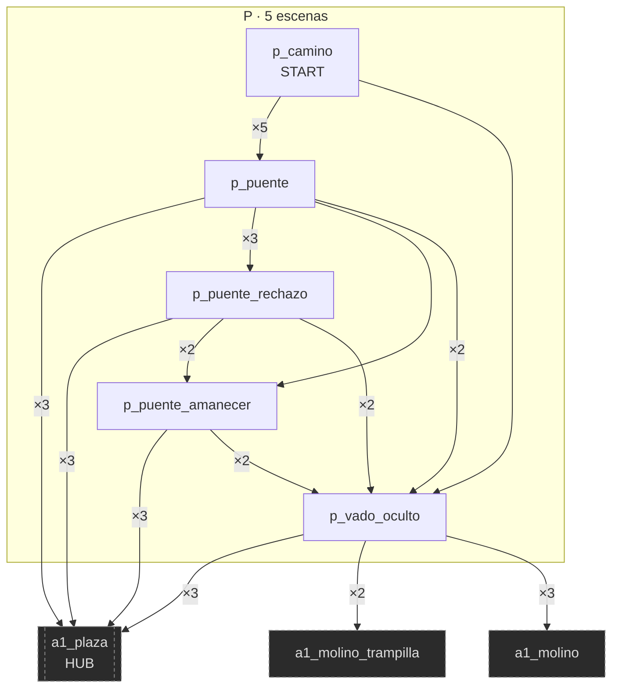
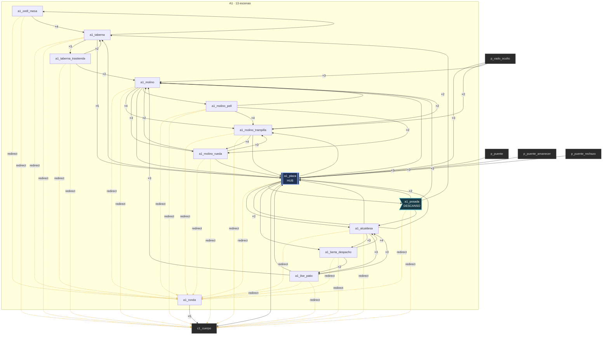
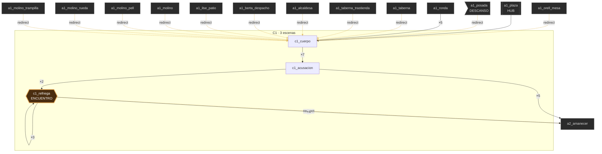
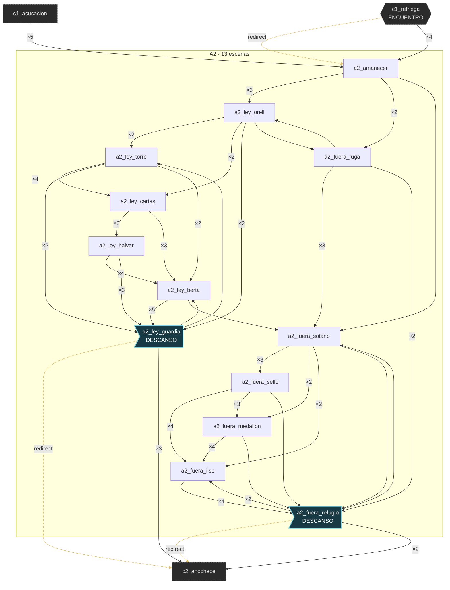
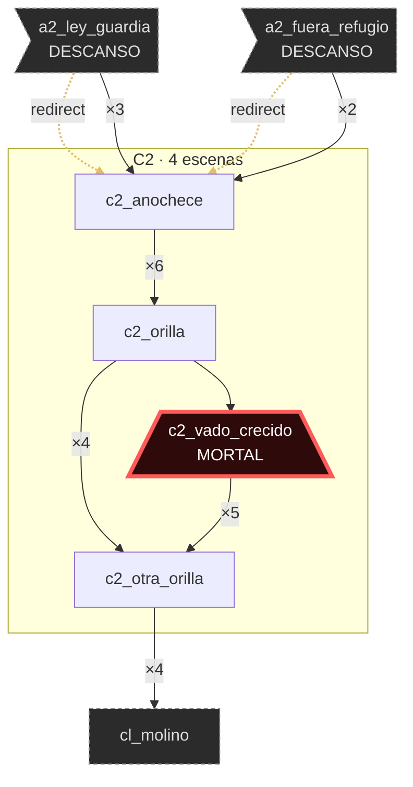
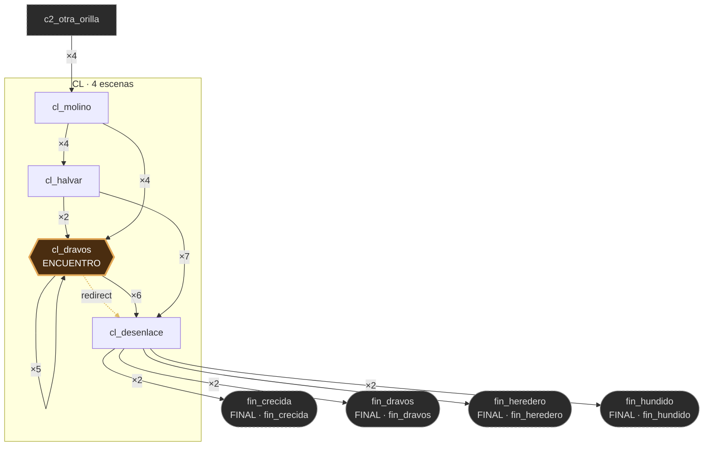
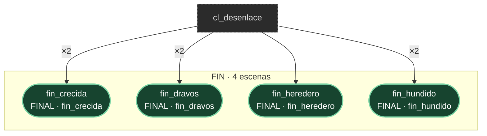

# Grafo de escenas — El vado de Aldamar (vado)

> Generado por `npm run graph`. **No se edita a mano**: sale del contenido, no del diseño.
> Sirve para comparar el grafo REAL contra el diagrama de `design/01-outline.md` §1.

**46 escenas** · **253 opciones** · 41 tiradas · 27 entradas de redirect · 4 finales · 1 escena(s) mortal(es)

Por tipo: 36 normales · 1 hub · 2 encuentros · 3 descansos · 4 finales

Escena inicial: `p_camino`. Actos (por prefijo de id): `p` · `a1` · `c1` · `a2` · `c2` · `cl` · `fin`.

## Grafo general

```mermaid
flowchart TD
  subgraph acto_p["P · 5 escenas"]
    p_camino["p_camino<br/>START"]
    p_puente["p_puente"]
    p_puente_amanecer["p_puente_amanecer"]
    p_puente_rechazo["p_puente_rechazo"]
    p_vado_oculto["p_vado_oculto"]
  end
  subgraph acto_a1["A1 · 13 escenas"]
    a1_orell_mesa["a1_orell_mesa"]
    a1_plaza[["a1_plaza<br/>HUB"]]
    a1_posada>"a1_posada<br/>DESCANSO"]
    a1_ronda["a1_ronda"]
    a1_taberna["a1_taberna"]
    a1_taberna_trastienda["a1_taberna_trastienda"]
    a1_alcaldesa["a1_alcaldesa"]
    a1_berta_despacho["a1_berta_despacho"]
    a1_ilse_patio["a1_ilse_patio"]
    a1_molino["a1_molino"]
    a1_molino_pell["a1_molino_pell"]
    a1_molino_rueda["a1_molino_rueda"]
    a1_molino_trampilla["a1_molino_trampilla"]
  end
  subgraph acto_c1["C1 · 3 escenas"]
    c1_acusacion["c1_acusacion"]
    c1_cuerpo["c1_cuerpo"]
    c1_refriega{{"c1_refriega<br/>ENCUENTRO"}}
  end
  subgraph acto_a2["A2 · 13 escenas"]
    a2_amanecer["a2_amanecer"]
    a2_ley_berta["a2_ley_berta"]
    a2_ley_cartas["a2_ley_cartas"]
    a2_ley_guardia>"a2_ley_guardia<br/>DESCANSO"]
    a2_ley_halvar["a2_ley_halvar"]
    a2_ley_orell["a2_ley_orell"]
    a2_ley_torre["a2_ley_torre"]
    a2_fuera_fuga["a2_fuera_fuga"]
    a2_fuera_ilse["a2_fuera_ilse"]
    a2_fuera_medallon["a2_fuera_medallon"]
    a2_fuera_refugio>"a2_fuera_refugio<br/>DESCANSO"]
    a2_fuera_sello["a2_fuera_sello"]
    a2_fuera_sotano["a2_fuera_sotano"]
  end
  subgraph acto_c2["C2 · 4 escenas"]
    c2_anochece["c2_anochece"]
    c2_orilla["c2_orilla"]
    c2_otra_orilla["c2_otra_orilla"]
    c2_vado_crecido[/"c2_vado_crecido<br/>MORTAL"\]
  end
  subgraph acto_cl["CL · 4 escenas"]
    cl_desenlace["cl_desenlace"]
    cl_dravos{{"cl_dravos<br/>ENCUENTRO"}}
    cl_halvar["cl_halvar"]
    cl_molino["cl_molino"]
  end
  subgraph acto_fin["FIN · 4 escenas"]
    fin_crecida(["fin_crecida<br/>FINAL · fin_crecida"])
    fin_dravos(["fin_dravos<br/>FINAL · fin_dravos"])
    fin_heredero(["fin_heredero<br/>FINAL · fin_heredero"])
    fin_hundido(["fin_hundido<br/>FINAL · fin_hundido"])
  end
  p_camino -->|"×5"| p_puente
  p_camino --> p_vado_oculto
  p_puente -->|"×3"| a1_plaza
  p_puente -->|"×3"| p_puente_rechazo
  p_puente --> p_puente_amanecer
  p_puente -->|"×2"| p_vado_oculto
  p_puente_amanecer -->|"×3"| a1_plaza
  p_puente_amanecer -->|"×2"| p_vado_oculto
  p_puente_rechazo -->|"×3"| a1_plaza
  p_puente_rechazo -->|"×2"| p_puente_amanecer
  p_puente_rechazo -->|"×2"| p_vado_oculto
  p_vado_oculto -->|"×3"| a1_plaza
  p_vado_oculto -->|"×2"| a1_molino_trampilla
  p_vado_oculto -->|"×3"| a1_molino
  a1_orell_mesa -. "redirect" .-> a1_ronda
  a1_orell_mesa -. "redirect" .-> c1_cuerpo
  a1_orell_mesa -->|"×4"| a1_taberna
  a1_plaza -. "redirect" .-> a1_ronda
  a1_plaza --> a1_taberna
  a1_plaza --> a1_alcaldesa
  a1_plaza --> a1_molino
  a1_plaza --> a1_posada
  a1_plaza -->|"×2"| a1_plaza
  a1_plaza --> a1_berta_despacho
  a1_plaza --> c1_cuerpo
  a1_plaza --> a1_molino_trampilla
  a1_posada -. "redirect" .-> a1_ronda
  a1_posada -. "redirect" .-> c1_cuerpo
  a1_posada -->|"×2"| a1_plaza
  a1_posada --> a1_taberna
  a1_posada --> a1_molino
  a1_posada --> a1_alcaldesa
  a1_ronda -->|"×5"| c1_cuerpo
  a1_taberna -. "redirect" .-> a1_ronda
  a1_taberna -. "redirect" .-> c1_cuerpo
  a1_taberna -->|"×3"| a1_taberna_trastienda
  a1_taberna -->|"×5"| a1_plaza
  a1_taberna --> a1_orell_mesa
  a1_taberna_trastienda -. "redirect" .-> a1_ronda
  a1_taberna_trastienda -. "redirect" .-> c1_cuerpo
  a1_taberna_trastienda -->|"×2"| a1_taberna
  a1_taberna_trastienda -->|"×2"| a1_molino
  a1_alcaldesa -. "redirect" .-> a1_ronda
  a1_alcaldesa -. "redirect" .-> c1_cuerpo
  a1_alcaldesa -->|"×3"| a1_berta_despacho
  a1_alcaldesa -->|"×3"| a1_ilse_patio
  a1_alcaldesa --> a1_plaza
  a1_berta_despacho -. "redirect" .-> a1_ronda
  a1_berta_despacho -. "redirect" .-> c1_cuerpo
  a1_berta_despacho -->|"×4"| a1_alcaldesa
  a1_berta_despacho -->|"×2"| a1_ilse_patio
  a1_ilse_patio -. "redirect" .-> a1_ronda
  a1_ilse_patio -. "redirect" .-> c1_cuerpo
  a1_ilse_patio -->|"×3"| a1_molino
  a1_ilse_patio -->|"×3"| a1_alcaldesa
  a1_ilse_patio --> a1_plaza
  a1_molino -. "redirect" .-> a1_ronda
  a1_molino -. "redirect" .-> c1_cuerpo
  a1_molino -->|"×4"| a1_molino_trampilla
  a1_molino -->|"×3"| a1_molino_rueda
  a1_molino --> a1_plaza
  a1_molino --> a1_molino_pell
  a1_molino_pell -. "redirect" .-> a1_ronda
  a1_molino_pell -. "redirect" .-> c1_cuerpo
  a1_molino_pell -->|"×4"| a1_molino_trampilla
  a1_molino_pell -->|"×2"| a1_molino
  a1_molino_pell -->|"×2"| a1_molino_rueda
  a1_molino_rueda -. "redirect" .-> a1_ronda
  a1_molino_rueda -. "redirect" .-> c1_cuerpo
  a1_molino_rueda -->|"×3"| a1_molino_trampilla
  a1_molino_rueda -->|"×2"| a1_molino
  a1_molino_rueda --> a1_plaza
  a1_molino_trampilla -. "redirect" .-> a1_ronda
  a1_molino_trampilla -. "redirect" .-> c1_cuerpo
  a1_molino_trampilla -->|"×4"| a1_molino_rueda
  a1_molino_trampilla -->|"×2"| a1_molino
  a1_molino_trampilla --> a1_plaza
  a2_amanecer -->|"×3"| a2_ley_orell
  a2_amanecer -->|"×2"| a2_fuera_fuga
  a2_amanecer --> a2_fuera_sotano
  a2_ley_berta -->|"×5"| a2_ley_guardia
  a2_ley_berta --> a2_fuera_sotano
  a2_ley_cartas -->|"×6"| a2_ley_halvar
  a2_ley_cartas -->|"×3"| a2_ley_berta
  a2_ley_guardia -. "redirect" .-> c2_anochece
  a2_ley_guardia -->|"×3"| c2_anochece
  a2_ley_guardia --> a2_ley_torre
  a2_ley_guardia --> a2_ley_berta
  a2_ley_halvar -->|"×4"| a2_ley_berta
  a2_ley_halvar -->|"×3"| a2_ley_guardia
  a2_ley_orell -->|"×2"| a2_ley_torre
  a2_ley_orell -->|"×2"| a2_ley_cartas
  a2_ley_orell -->|"×2"| a2_ley_guardia
  a2_ley_orell --> a2_fuera_fuga
  a2_ley_torre -->|"×4"| a2_ley_cartas
  a2_ley_torre -->|"×2"| a2_ley_guardia
  a2_ley_torre -->|"×2"| a2_ley_berta
  c1_acusacion -->|"×5"| a2_amanecer
  c1_acusacion -->|"×2"| c1_refriega
  c1_cuerpo -->|"×7"| c1_acusacion
  c1_refriega -. "redirect" .-> a2_amanecer
  c1_refriega -->|"×3"| c1_refriega
  c1_refriega -->|"×4"| a2_amanecer
  a2_fuera_fuga -->|"×3"| a2_fuera_sotano
  a2_fuera_fuga -->|"×2"| a2_fuera_refugio
  a2_fuera_fuga --> a2_ley_orell
  a2_fuera_ilse -->|"×4"| a2_fuera_refugio
  a2_fuera_medallon -->|"×4"| a2_fuera_ilse
  a2_fuera_medallon --> a2_fuera_refugio
  a2_fuera_refugio -. "redirect" .-> c2_anochece
  a2_fuera_refugio -->|"×2"| c2_anochece
  a2_fuera_refugio --> a2_fuera_sotano
  a2_fuera_refugio -->|"×2"| a2_fuera_ilse
  a2_fuera_sello -->|"×4"| a2_fuera_ilse
  a2_fuera_sello -->|"×3"| a2_fuera_medallon
  a2_fuera_sello --> a2_fuera_refugio
  a2_fuera_sotano -->|"×3"| a2_fuera_sello
  a2_fuera_sotano -->|"×2"| a2_fuera_medallon
  a2_fuera_sotano -->|"×2"| a2_fuera_ilse
  a2_fuera_sotano --> a2_fuera_refugio
  c2_anochece -->|"×6"| c2_orilla
  c2_orilla --> c2_vado_crecido
  c2_orilla -->|"×4"| c2_otra_orilla
  c2_otra_orilla -->|"×4"| cl_molino
  c2_vado_crecido -->|"×5"| c2_otra_orilla
  cl_desenlace -->|"×2"| fin_hundido
  cl_desenlace -->|"×2"| fin_dravos
  cl_desenlace -->|"×2"| fin_crecida
  cl_desenlace --> fin_heredero
  cl_dravos -. "redirect" .-> cl_desenlace
  cl_dravos -->|"×5"| cl_dravos
  cl_dravos -->|"×6"| cl_desenlace
  cl_halvar -->|"×7"| cl_desenlace
  cl_halvar -->|"×2"| cl_dravos
  cl_molino -->|"×4"| cl_halvar
  cl_molino -->|"×4"| cl_dravos
  classDef hub fill:#20304f,stroke:#8fb4ff,color:#ffffff,stroke-width:3px;
  classDef encuentro fill:#4a2d10,stroke:#e3a857,color:#ffffff,stroke-width:3px;
  classDef descanso fill:#173a44,stroke:#7fd4e0,color:#ffffff,stroke-width:2px;
  classDef final fill:#17442f,stroke:#79d4a4,color:#ffffff,stroke-width:2px;
  classDef mortal fill:#2e0a0a,stroke:#ff5a5a,color:#ffffff,stroke-width:4px;
  classDef externo fill:#2b2b2b,stroke:#8a8a8a,color:#dddddd,stroke-dasharray:4 3;
  classDef faltante fill:#3d0000,stroke:#ff0000,color:#ffffff,stroke-dasharray:4 3;
  class a1_plaza hub;
  class a1_posada,a2_ley_guardia,a2_fuera_refugio descanso;
  class c1_refriega,cl_dravos encuentro;
  class c2_vado_crecido mortal;
  class fin_crecida,fin_dravos,fin_heredero,fin_hundido final;
  linkStyle 14,15,17,26,27,33,34,38,39,42,43,47,48,51,52,56,57,62,63,67,68,72,73,84,100,109,129 stroke:#e0be6a,stroke-width:2px;
```

## Por acto

Con 46 escenas el diagrama general se lee como un plano de cables: estos son los mismos
nodos acto por acto, con los vecinos de afuera en gris punteado.

### Acto `p` (5 escenas)

### Acto `a1` (13 escenas)

### Acto `c1` (3 escenas)

### Acto `a2` (13 escenas)

### Acto `c2` (4 escenas)

### Acto `cl` (4 escenas)

### Acto `fin` (4 escenas)

